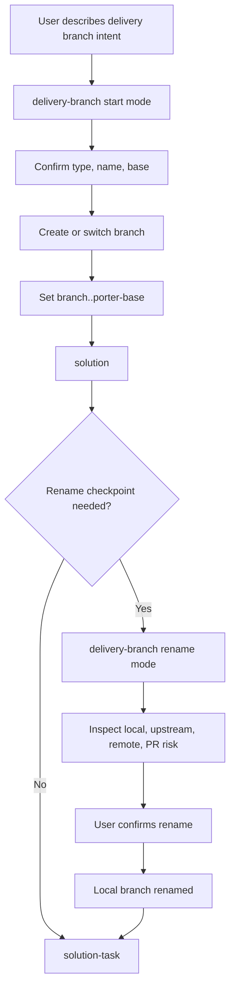

# 方案：新增 delivery-branch Git 分支入口

## 时间线上下文

- Timeline overview：`.codex/timeline/delivery-git-lifecycle/OVERVIEW.md`
- 当前 MVP：MVP 2 Delivery Git 生命周期
- Timeline：`.codex/timeline/delivery-git-lifecycle/`
- Active slice：`001-feat-delivery-branch`
- 当前分支：`feat/delivery-git-lifecycle`
- Base 分支：`master`
- 内容闭环：`solution -> solution-task -> solution-execute -> solution-review`
- 本 slice 目标入口：`$porter-codex-plugin:delivery-branch`

## 类型决策

- 用户纠偏：将原本过大的 `delivery-git-lifecycle foundation` 拆成阶段 overview，并把第一个 solution 收窄为 `delivery-branch`。
- 讨论确认类型：`feat`
- 选定类型：`feat`
- 分支类型：`feat`
- 置信度：高
- 理由：`delivery-branch` 是新的 Codex 插件 skill 入口，会新增用户可调用的 Git 分支工作流能力。
- 备选考虑：`docs` 不合适，因为目标不是只记录说明；`refactor` 不合适，因为会新增入口；`chore` 不合适，因为会改变用户可感知 workflow。

## 分支重命名检查点

- 当前分支：`feat/delivery-git-lifecycle`
- 选定类型：`feat`
- 建议分支：`feat/delivery-git-lifecycle`
- 是否需要重命名：否
- 理由：当前分支仍用于 MVP 2 Delivery Git 生命周期建设；本 slice 只是其中第一个 delivery-branch 能力。
- 后续交付动作：本 solution 阶段不提交、不合并、不 push、不创建 PR。

## 目标

新增 `plugins/porter-codex-plugin/skills/delivery-branch/SKILL.md`，提供一条新的普通 Git 分支入口：

- 起步模式：从用户确认的 base 创建或切换普通 Git 分支，并记录 `branch.<branch>.porter-base`。
- Rename checkpoint 模式：读取 active solution 中的分支重命名检查点，展示影响范围，并在用户明确确认后执行本地分支 rename。

`delivery-branch` 只处理分支创建、切换和 rename checkpoint，不进入 solution、task、execute、review，也不执行 commit、push、merge 或 PR 创建。

## 问题

现有 `new-branch` 可以创建普通 Git 分支，但它仍然绑定旧 branch workflow 的下一步提示：

```text
plan-branch -> task-branch -> execute-branch -> review-branch -> commit-branch -> merge-branch-to-base
```

MVP 1 之后的新主线已经变成：

```text
solution -> solution-task -> solution-execute -> solution-review
```

同时，`solution` 会输出分支重命名检查点，但目前没有一个新的 delivery skill 专门处理这个检查点。结果是：

- 用户用粗描述开始工作后，后续 solution 明确 type/slug 时缺少安全 rename 入口。
- 分支 base、粗分支创建、rename checkpoint、upstream 风险容易和 commit/push/PR 动作混在一起。
- 如果直接修改旧 `new-branch`，会影响仍在使用的旧 branch workflow。

因此第一个 delivery slice 应先新增 `delivery-branch`，让分支生命周期起点独立出来。

## 已读上下文

- [x] `AGENTS.md`
- [x] `.codex/constitution.md`
- [x] `.codex/timeline/delivery-git-lifecycle/OVERVIEW.md`
- [x] `plugins/porter-codex-plugin/skills/new-branch/SKILL.md`
- [x] `plugins/porter-codex-plugin/skills/solution/SKILL.md`
- [x] `plugins/porter-codex-plugin/skills/solution-task/SKILL.md`
- [x] `$porter-codex-plugin:solution` skill 规则

## 范围

### 做

- 新增 `plugins/porter-codex-plugin/skills/delivery-branch/SKILL.md`。
- 定义 `delivery-branch` 的阶段边界：只创建/切换/重命名普通 Git 分支。
- 定义起步模式：
  - 从用户自然语言中整理候选 type/name，但必须明示给用户确认。
  - base 分支必须由用户明确确认；不能静默使用远端默认分支。
  - 创建或切换普通分支后写入 `branch.<branch>.porter-base`。
  - 完成后停止，提示进入 `$porter-codex-plugin:solution`。
- 定义 rename checkpoint 模式：
  - 读取当前 timeline 的 `current.json` 和 active solution。
  - 找到`分支重命名检查点`中的当前分支、建议分支和是否需要重命名。
  - 检查当前分支、工作区、upstream、远端同名分支和可能的 PR 状态。
  - 展示影响范围，等待用户明确确认。
  - 只在确认后执行本地分支 rename，并校验 `branch.<new>.porter-base`。
  - 不删除远端旧分支、不 force push、不修改 PR。
- 在 README 中增加 `delivery-branch` 的简短入口说明和推荐起步路径。
- 如 Codex 插件 manifest/cachebuster 需要更新，在执行阶段同步处理。
- 验证新增 skill frontmatter、路径、命名和 Markdown 结构。

### 不做

- 不新增 `delivery-commit`、`delivery-push`、`delivery-create-pr`、`delivery-merge-to-base`。
- 不修改 `plugins/porter-claude-plugin/`。
- 不删除或替换旧 `new-branch`。
- 不修改 `solution-task` 的前置门禁；rename checkpoint 的自动门禁可作为后续 slice。
- 不执行真实 commit、push、merge 或 PR 创建。
- 不处理 worktree 并行分支。
- 不引入运行时依赖、构建工具或测试框架。

## 类型专项分析

### 功能目标

让用户在 Codex 插件的新 solution workflow 之前，有一个更贴合新主线的分支入口，并为 solution 产出的 branch rename checkpoint 提供显式执行位置。

### 用户价值

用户可以先用粗描述开始普通分支，再让 solution 澄清 type、目标、范围和 slug。若 solution 建议调整分支名，用户可以通过 `delivery-branch` 查看影响并确认 rename，而不是手动记住 Git 命令或把 rename 混入 task/commit 阶段。

### 功能边界

做：

- 分支创建。
- 分支切换。
- 记录 `porter-base`。
- 读取并执行 solution rename checkpoint。

不做：

- 不写 solution 文件。
- 不拆 task。
- 不提交。
- 不推送。
- 不合并。
- 不创建 PR。

### 方案设计

`delivery-branch` 使用两个显式模式，不靠隐式状态魔法切换：

1. 起步模式
   - 用户描述要开始的工作。
   - skill 整理候选 type/name/base。
   - type、name、base 必须展示并获得确认。
   - 创建或切换普通分支。
   - 写入 `branch.<branch>.porter-base`。
   - 停止并提示下一步调用 `$porter-codex-plugin:solution`。

2. Rename checkpoint 模式
   - 用户明确要求处理 rename checkpoint，或当前上下文需要先处理分支重命名。
   - skill 读取 `.codex/timeline/<timeline-name>/current.json` 和 active solution。
   - 从`分支重命名检查点`读取当前分支、建议分支、是否需要重命名。
   - 检查本地分支、工作区、upstream 和远端风险。
   - 明确说明不会删除远端旧分支、不会 force push、不会修改 PR。
   - 等待用户确认后再执行本地 rename。
   - 停止并提示回到原 workflow，例如 `$porter-codex-plugin:solution-task`。

### 目录结构

预计新增：

```text
plugins/porter-codex-plugin/skills/delivery-branch/SKILL.md
```

预计修改：

```text
README.md
plugins/porter-codex-plugin/.codex-plugin/plugin.json
```

只在需要暴露新 skill 或刷新 cachebuster 时修改 manifest。

### 接口或配置

新增显式调用入口：

```text
$porter-codex-plugin:delivery-branch
```

复用 Git config：

```text
branch.<branch-name>.porter-base
```

可选读取 timeline：

```text
.codex/timeline/<timeline-name>/current.json
.codex/timeline/<timeline-name>/solutions/<slice>.md
```

### 数据流

```text
用户粗描述
  -> delivery-branch 起步模式
  -> 确认 type / name / base
  -> 创建普通分支并记录 porter-base
  -> solution 澄清目标并写入分支重命名检查点
  -> 如需 rename，用户调用 delivery-branch rename checkpoint 模式
  -> 确认影响后本地 rename
  -> 回到 solution-task
```

### 实现顺序

1. 新增 `delivery-branch/SKILL.md`，先写清 frontmatter、阶段边界和两种模式。
2. 复用 `new-branch` 中 base 确认、远端 fallback、普通分支创建和 `porter-base` 记录规则。
3. 增加 rename checkpoint 读取和风险展示规则。
4. 更新 README 的 Codex skill 表和推荐 workflow。
5. 如需要，刷新 Codex 插件 cachebuster。
6. 做 Markdown/frontmatter/path/diff 验证。

## 视觉模型



## 拟议变更

- 把原 `001` 的阶段蓝图内容移动到 `.codex/timeline/delivery-git-lifecycle/OVERVIEW.md`。
- 将 active slice 收窄为 `001-feat-delivery-branch`。
- 后续 task 阶段只围绕 `delivery-branch` 拆任务。
- 本 solution 阶段不新增真实 skill 文件，不执行 Git 操作。

## 验收标准

- `delivery-branch` skill frontmatter 完整，路径为 `plugins/porter-codex-plugin/skills/delivery-branch/SKILL.md`。
- 起步模式必须要求用户确认 type、name 和 base。
- 起步模式创建或切换普通分支后必须记录 `branch.<branch>.porter-base`。
- Rename checkpoint 模式能读取 active solution 的`分支重命名检查点`。
- Rename checkpoint 模式必须展示本地分支、工作区、upstream、远端同名分支和 PR 风险。
- Rename checkpoint 模式必须等待用户明确确认后才执行本地 rename。
- `delivery-branch` 不 commit、不 push、不 merge、不 create PR、不写 solution/task/review。
- README 能说明 `delivery-branch -> solution` 的推荐起步路径。
- 不修改 Claude 插件。
- 不删除旧 `new-branch`。
- 不引入运行时依赖或构建工具。
- `git diff --check` 通过。

## 风险

- `delivery-branch` 同时承担起步和 rename checkpoint，文档需要把两个模式写得足够清楚，避免变成新的大而全入口。
- Rename checkpoint 涉及 upstream 和远端分支，必须避免默认删除远端旧分支或 force push。
- 如果 README 过早推荐完整 delivery workflow，可能让用户误以为所有 `delivery-*` skill 都已实现；本 slice 只能说明 `delivery-branch` 是第一步。
- 如果直接改旧 `new-branch`，会影响旧 workflow；本 slice 应新增入口并保留旧入口。

## 待确认

- [ ] type 选择为 `feat` 是否正确。
- [ ] `001` 收窄为 `delivery-branch` 是否正确。
- [ ] 输出路径和 slice 命名是否正确：`.codex/timeline/delivery-git-lifecycle/solutions/001-feat-delivery-branch.md`。
- [ ] 是否接受 `delivery-branch` 同时包含起步模式和 rename checkpoint 模式。
- [ ] 是否接受本 slice 不修改 `solution-task` 前置门禁，门禁集成留到后续 slice。
- [ ] 是否接受保留旧 `new-branch`，本 slice 只新增入口。
- [ ] 风险和验收标准是否接受。
- [ ] 是否可以进入 `$porter-codex-plugin:solution-task`。

## 下一步

Solution 已生成。请先确认`待确认`章节。还有要补充或调整的吗？如果无需调整，请显式调用 `$porter-codex-plugin:solution-task` 生成任务清单。
