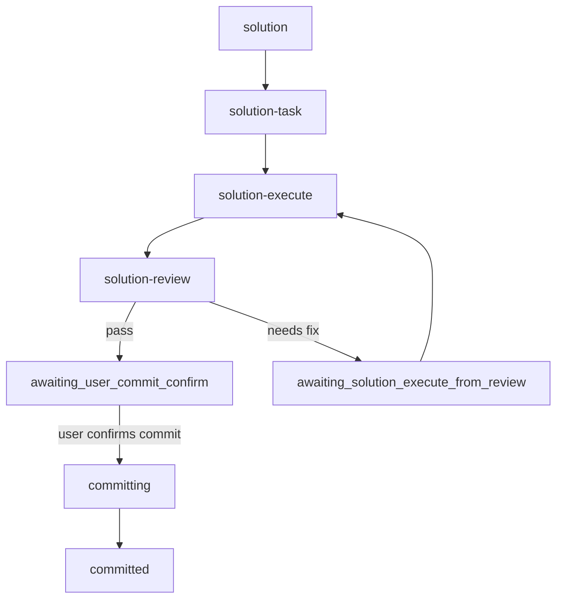

# 方案：整合 solution 与 Git commit 生命周期

## 时间线上下文

- Timeline overview：`.codex/timeline/delivery-git-lifecycle/OVERVIEW.md`
- Timeline：`.codex/timeline/delivery-git-lifecycle/`
- Active slice：`002-refactor-solution-git-integration`
- 当前 checkout：`feat/delivery-git-lifecycle`
- 内容闭环：`solution -> solution-task -> solution-execute -> solution-review -> awaiting_user_commit_confirm`

## 类型决策

- 选定类型：`refactor`
- 置信度：高
- 理由：本 slice 主要重塑 Codex plugin 的工作流边界和状态模型，删除旧 branch/worktree workflow，并让 solution workflow 成为主线。
- 备选考虑：`feat` 适用于新增用户能力，但本轮更像 breaking workflow consolidation；`build` 只覆盖版本跃迁，不足以表达整体调整。

## 工作上下文

- 当前分支不是 `main` / `master`。
- 本 slice 不要求分支名匹配 slice type。
- `v1.9.0` tag 用作删除旧 workflow 前的恢复点。
- 不写 `branch.<branch>.porter-base`。

## 目标

把 Codex plugin 从旧 branch/worktree Git workflow 收敛到 solution-first workflow：

- solution 四段 workflow 去强分支化。
- review pass 后进入 `awaiting_user_commit_confirm`。
- 用户确认后使用普通 Git commit，并用 trailers 保留 timeline/slice 身份。
- 删除旧 branch/worktree workflow 和旧 Codex workflow guard。
- 版本跃迁到 `2.0.0+codex.*`。
- 回修补齐随插件分发的 Git `commit-msg` hook 安装能力。
- 回修补齐 `solution-task` 前置分支名对齐 hook。
- 回修补齐 review pass 后的 staging 白名单，commit confirmation 只能提交已审查路径和 active state。
- 回修补齐 review pass 后的内容版本校验，commit confirmation 只能提交已审查路径的已审查 blob；其它 stale timeline 不阻塞当前已匹配 committed slice。

## 问题

旧体系把分支创建、plan/task/execute/review/commit/merge/PR 都做成插件 skill，导致：

- solution workflow 与旧 plan workflow 并存，状态模型重复。
- branch base、push-only、PR-only、暂不合入等场景和 `porter-base` 语义混在一起。
- Codex app 已经具备 Git 操作能力，插件继续包装 Git 动作收益不高。

## 已读上下文

- [x] `AGENTS.md`
- [x] `.codex/constitution.md`
- [x] `.codex/timeline/delivery-git-lifecycle/OVERVIEW.md`
- [x] `plugins/porter-codex-plugin/skills/solution/SKILL.md`
- [x] `plugins/porter-codex-plugin/skills/solution-task/SKILL.md`
- [x] `plugins/porter-codex-plugin/skills/solution-execute/SKILL.md`
- [x] `plugins/porter-codex-plugin/skills/solution-review/SKILL.md`
- [x] `README.md`
- [x] `plugins/porter-codex-plugin/.codex-plugin/plugin.json`

## 范围

### 做

- 更新 `solution`、`solution-task`、`solution-execute`、`solution-review` 的状态和分支前置规则。
- 更新 task header 模板。
- 增加 commit message contract 校验脚本。
- 更新 README 和 `skill-recommender`。
- 创建 `v1.9.0` tag。
- 删除旧 Codex branch/worktree workflow 源文件和旧 Codex hooks。
- bump Codex plugin 到 `2.0.0+codex.*`。
- 更新 timeline 记录。
- 新增 solution commit-msg hook 和显式安装脚本。
- 新增 `solution-task` 写入前的 Codex branch alignment hook。

### 不做

- 不修改 `plugins/porter-claude-plugin/`。
- 不写入用户本机 `~/.codex`、`~/.agents`、`~/.claude` 配置。
- 不新增运行时依赖或构建工具。
- 不实现 push、PR、merge skill。
- 不把 commit hash 写为 state 必填字段。

## 类型专项分析

### 结构调整

旧 branch/worktree workflow 从 Codex plugin 退场，solution workflow 成为主开发流。旧体系通过 `v1.9.0` tag 保留恢复点。

### 状态模型

`solution-review` pass 不再进入旧 `awaiting_commit`，而是进入 `awaiting_user_commit_confirm`。用户确认后普通 Git commit 将 state 写为 `committed` 并随同提交进入 Git 历史。

### 可追踪性

commit message trailer 提供跨 cherry-pick/rebase 更稳定的逻辑身份：

```text
Codex-Timeline: delivery-git-lifecycle
Codex-Slice: 002-refactor-solution-git-integration
```

## 视觉模型



## 拟议变更

- Rewrite solution workflow docs around active slice/state gate.
- Remove old workflow source files from Codex plugin.
- Refresh README, recommender, manifest, timeline state.
- Add a small shell validator for commit message subject/type/trailers.
- Add an explicitly installable Git `commit-msg` hook for ordinary `git commit` validation.
- Add a narrow Codex `PreToolUse` hook for `solution-task` branch-name alignment.

## 验收标准

- 旧 Codex branch/worktree workflow skill 文件已删除。
- Codex hooks 中旧 `workflow-guard` 已删除。
- README 不再推荐旧 branch/worktree workflow。
- `solution-review` pass state 是 `awaiting_user_commit_confirm`。
- commit message validator 能接受正确样例、拒绝缺 trailer 样例。
- `plugin.json` 可解析，版本为 `2.0.0+codex.*`。
- 保留 `v1.9.0` tag。
- 插件随包提供可显式安装的 `commit-msg` hook，安装后普通 `git commit` 自动检查。
- commit message validator 拒绝不在 solution workflow type 白名单内的提交类型。
- `solution-task` 写入 task 文件前自动将本地分支名对齐到 `<type>/<solution-slug>`；不因 state 文件或 `current.json` 写入触发；有 upstream 或目标分支冲突时停止。
- 未终止 active solution state 不能通过普通 `git commit` 绕过 review/commit confirmation；review pass 后继续写非 state 文件会被 Codex lifecycle hook 阻止。
- Review pass 必须记录显式 `reviewed_paths` contract；Codex lifecycle hook 和 Git `commit-msg` hook 都只允许 active state、review contract 与 contract 中的文件进入本次 commit。
- Review pass contract 必须记录 `reviewed_path_blobs`；Codex lifecycle hook 和 Git `commit-msg` hook 都必须拒绝 review 后同路径内容漂移，删除路径用 `__deleted__` 表示。
- 当前 commit message 已匹配一个 staged `committed` solution state 时，其它 stale `current.json` 不应阻塞该 committed slice 的提交。
- Review pass 必须生成固定路径 review contract 文件；state 只记录 contract 路径和 contract blob，commit hook 不信任提交前可改写的 state 白名单。
- Review contract 必须同时记录 `reviewed_paths`、`reviewed_path_blobs` 和 `reviewed_path_modes`；同路径内容、删除状态或 file mode 漂移都必须被 Codex lifecycle hook 或 Git `commit-msg` hook 拒绝。
- Codex lifecycle guard 在 commit confirmation 阶段必须拒绝复合 Bash 写入/stage、多段 `git add` 漏检、宽泛 pathspec 和 `git -C` 路径基准混淆。
- `git diff --check` 通过。
- Codex plugin validator 通过。

## 风险

- 2.0.0 是 breaking cleanup，旧入口使用者需要通过 `v1.9.0` tag 找回旧体系。
- 本轮删除 Codex 侧旧 workflow，不同步删除 Claude 侧对应配置，需保持跨环境边界清晰。
- commit confirmation 是普通对话动作，不是新 skill；后续新线程需要通过 state 文件和 README 理解该动作。
- Git `commit-msg` hook 是每个目标仓库的本地配置，插件只能随包提供安装器；不会在插件安装时隐式写入用户项目 `.git/hooks`。
- `solution-task` branch alignment hook 只做本地 rename；遇到 upstream 或目标分支冲突必须停止，避免误触远端/PR 风险。
- Review contract 必须保持显式文件级白名单；如果写入目录、`.` 或遗漏实际已审查文件，会导致 commit confirmation 无法 staging 或 commit hook 拒绝提交。
- `reviewed_path_blobs` 和 `reviewed_path_modes` 需要覆盖新增、修改和删除三类路径；如果 review pass 后又改变同一路径内容或 mode，必须回到 execute/review 重新生成 contract。

## 待确认

- 无；用户已授权按 overview 执行到完成，并允许 final cleanup 删除旧 workflow、打 `v1.9.0` tag、升 2.0.0。

## 下一步

执行 task 并进入 review。
