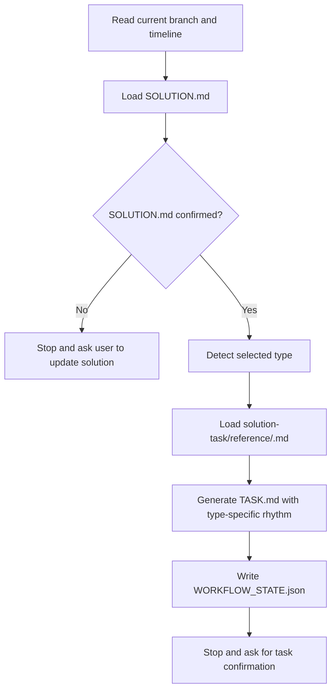

# Solution: Define Solution Task

## Timeline Context

- Stage overview: `.codex/timeline/mvp/workflow-architecture-refactor/STAGE_OVERVIEW.md`
- MVP overview: `.codex/timeline/mvp/workflow-architecture-refactor/MVP_OVERVIEW.md`
- MVP: 1 - Solution 最小闭环
- Work slice: 002
- Slice type: `feat`
- Branch: `feat/refactor-feature-development`
- Timeline path: `.codex/timeline/feat/refactor-feature-development/`

## Type Decision

- Discussion confirmed type: `feat`
- User correction: none
- Branch type: `feat`
- Selected type: `feat`
- Confidence: high
- Reason: 本 slice 新增 `solution-task` workflow 能力，是用户可显式调用的新入口。
- Alternatives considered: `refactor` 不合适，因为不是仅调整旧 `task`，而是新增独立 solution 链路阶段。

## Branch Rename Checkpoint

- Current branch: `feat/refactor-feature-development`
- Selected type: `feat`
- Suggested branch: `feat/refactor-feature-development`
- Rename needed: no
- Reason: 当前分支仍覆盖 workflow architecture refactor 的 MVP 1 内容闭环。
- Delivery action: 无

## Goal

新增 `$porter-codex-plugin:solution-task`，让已经确认的 `SOLUTION.md` 可以生成新 solution 链路的 `TASK.md`，作为 `solution -> solution-task -> solution-execute -> solution-review` 最小闭环中的第二段。

## Problem

旧 `task` / `task-branch` 依赖：

- `plan/<type>/<branch-name>/PLAN.md`
- `plan/<type>/<branch-name>/ANALYSIS.md`
- `plan/<type>/<branch-name>/TASK.md`

新 solution 链路已经把方案统一到：

```text
.codex/timeline/<branch-type>/<branch-name>/SOLUTION.md
```

所以 `solution-task` 不能继续读取旧 `PLAN.md` / `ANALYSIS.md`，也不能把输出写回旧 `plan/` 目录。它需要从 `SOLUTION.md` 的通用字段、`Type-Specific Analysis`、`Visual Model` 和 `Acceptance` 中生成可执行任务，并保持 TDD / 度量 / 文档验证等 type-specific 节奏。

当前 MVP 1 还没有引入 MVP 容器或多 slice 目录结构。因此本 slice 继续使用当前 timeline 根目录的 `SOLUTION.md`、`TASK.md`、`REVIEW.md` 和 `WORKFLOW_STATE.json`；上一轮 slice 001 的内容通过 Git 提交历史保留，不在文件路径上提前引入新的容器层。

## Context Read

- [x] `AGENTS.md`
- [x] `.codex/constitution.md`
- [x] `.codex/timeline/mvp/workflow-architecture-refactor/STAGE_OVERVIEW.md`
- [x] `.codex/timeline/mvp/workflow-architecture-refactor/MVP_OVERVIEW.md`
- [x] `plugins/porter-codex-plugin/skills/task/SKILL.md`
- [x] `plugins/porter-codex-plugin/skills/task-branch/SKILL.md`
- [x] `plugins/porter-codex-plugin/skills/task/reference/feat.md`
- [x] `plugins/porter-codex-plugin/skills/task/templates/task_header.md`
- [x] `plugins/porter-codex-plugin/skills/solution/SKILL.md`

## Scope

### In

- 新增 `plugins/porter-codex-plugin/skills/solution-task/SKILL.md`。
- 新增 `plugins/porter-codex-plugin/skills/solution-task/reference/*.md`，覆盖 `feat`、`fix`、`refactor`、`perf`、`test`、`docs`、`build`、`ci`、`chore`、`style`。
- 新增 `plugins/porter-codex-plugin/skills/solution-task/templates/task-header.md`。
- 定义 `solution-task` 的输入、输出、阶段边界和状态流。
- 明确 `solution-task` 只读取 `SOLUTION.md`，不读取旧 `PLAN.md` / `ANALYSIS.md`。
- 明确 `fix` 任务必须从复现测试开始。
- 明确 `perf` 任务必须先度量，再优化，再验证。
- 明确无业务逻辑的文档配置类任务通过结构审查验证。

### Out

- 不实现 `solution-execute`。
- 不实现 `solution-review`。
- 不实现 `delivery-*` Git 生命周期。
- 不修改旧 `task` / `task-branch` / `task-worktree`。
- 不处理 worktree 并行模式。
- 不引入 MVP 容器目录结构。
- 不在本 slice 实现 hook guard 对 `.codex/timeline/` 的强约束。

## Type-Specific Analysis

### Entry Semantics

唯一入口：

```text
$porter-codex-plugin:solution-task
```

`solution-task` 的职责是把已确认的 `SOLUTION.md` 拆成 `TASK.md`。它不和用户重新讨论方案方向；如果发现 `SOLUTION.md` 的 `Confirmation Needed` 未解决、type 不清楚、验收不完整，则停止并提示回到 `$porter-codex-plugin:solution` 调整方案。

### Input

读取当前分支 timeline：

```text
.codex/timeline/<branch-type>/<branch-name>/SOLUTION.md
```

多 slice 文件结构留到后续 MVP 容器阶段设计。

### Output

生成：

```text
.codex/timeline/<branch-type>/<branch-name>/TASK.md
.codex/timeline/<branch-type>/<branch-name>/WORKFLOW_STATE.json
```

### State Transition

建议状态：

```json
{
  "state": "awaiting_solution_execute",
  "current_skill": "$porter-codex-plugin:solution-task",
  "next_skill": "$porter-codex-plugin:solution-execute",
  "timeline": ".codex/timeline/<branch-type>/<branch-name>",
  "allowed_outputs": [
    ".codex/timeline/<branch-type>/<branch-name>/TASK.md",
    ".codex/timeline/<branch-type>/<branch-name>/WORKFLOW_STATE.json"
  ]
}
```

### Task Generation Rules

- `feat`：有可执行行为变化时必须遵循 TDD Red / Green / Refactor；行为测试必须包含 Case / Given / When / Then / Assert 或 Verify；无业务逻辑的 skill 文档和 reference 可标注"无需测试，通过结构审查验证"。
- 所有 type 的任务都必须包含 `验收标准` 和 `验证方式`；验收标准应对应 `SOLUTION.md` 的 `Acceptance`，验证方式应说明可观察证据。
- `fix`：Task 1 必须是复现 Bug 的失败测试；Task 2 是最小修复；Task 3 是回归验证。
- `refactor`：每步重构必须保持行为不变，任务中明确回归检查点。
- `perf`：Task 1 必须是基线度量或采集计划；优化任务必须在度量之后；最后必须有量化验证。
- `fix` / `perf`：生成的修复或优化任务是有条件的；如果执行时复现、根因、基线或瓶颈判断被推翻，应先进入 review 记录问题，再由 review 回修执行更新 `TASK.md`，必要时更新 `SOLUTION.md`。
- `test`：只生成测试相关任务，不生成实现任务，除非测试基础设施缺失。
- `docs`：生成写作、结构审查、链接检查任务。
- `build`：生成配置修改、构建验证和产物验证任务；如果没有持久产物，必须记录原因并验证可观察输出。
- `ci`：生成配置修改和可运行验证任务。
- `chore`：按风险决定是否需要测试；至少需要结构审查或 diff 审查。
- `style`：生成格式化、命名、lint 或结构一致性验证任务。

### Stop Rule

生成 `TASK.md` 后必须停止，询问用户是否要补充、删除或调整任务。

如果用户确认无调整，再提示显式调用：

```text
$porter-codex-plugin:solution-execute
```

## Visual Model



## Proposed Changes

- Add `plugins/porter-codex-plugin/skills/solution-task/SKILL.md`.
- Add `plugins/porter-codex-plugin/skills/solution-task/reference/feat.md`.
- Add `plugins/porter-codex-plugin/skills/solution-task/reference/fix.md`.
- Add `plugins/porter-codex-plugin/skills/solution-task/reference/refactor.md`.
- Add `plugins/porter-codex-plugin/skills/solution-task/reference/perf.md`.
- Add `plugins/porter-codex-plugin/skills/solution-task/reference/test.md`.
- Add `plugins/porter-codex-plugin/skills/solution-task/reference/docs.md`.
- Add `plugins/porter-codex-plugin/skills/solution-task/reference/build.md`.
- Add `plugins/porter-codex-plugin/skills/solution-task/reference/ci.md`.
- Add `plugins/porter-codex-plugin/skills/solution-task/reference/chore.md`.
- Add `plugins/porter-codex-plugin/skills/solution-task/reference/style.md`.
- Add `plugins/porter-codex-plugin/skills/solution-task/templates/task-header.md`.

## Acceptance

- `solution-task` skill frontmatter is valid.
- `solution-task` only generates or updates `TASK.md` and `WORKFLOW_STATE.json`.
- `solution-task` does not execute tasks, review, commit, merge, push, or create PR.
- `solution-task` reads `SOLUTION.md`, not old `PLAN.md` / `ANALYSIS.md`.
- `solution-task` refuses to proceed if `SOLUTION.md` lacks selected type, acceptance, scope, or unresolved confirmation handling.
- `TASK.md` has a consistent header and task status legend.
- Every generated task includes `验收标准` and `验证方式`.
- `feat` tasks use Red / Green / Refactor for executable behavior and include Case / Given / When / Then / Assert or Verify in behavior tests.
- `fix` tasks start with a reproduction test.
- `perf` tasks start with baseline measurement or a baseline collection plan.
- `fix` / `perf` references state that stale fix or optimization tasks must not continue when execution contradicts reproduction, root cause, baseline, or bottleneck assumptions.
- `build` tasks include artifact verification, not only build command success.
- `docs` / `chore` / `style` tasks can explicitly mark "无业务逻辑，无需测试" and use structure review as validation.
- `WORKFLOW_STATE.json` transitions to `awaiting_solution_execute`.
- The implementation does not modify old `task-*` skills.
- The implementation does not introduce MVP container structures.

## Risks

- 当前 root timeline 只有一组 `SOLUTION.md` / `TASK.md` / `REVIEW.md`，后续 slice 会覆盖上一轮工作文件；当前阶段接受这一点，依赖 Git 提交历史追溯，避免提前引入 MVP 容器结构。
- 如果 `solution-task` 复用旧 `task/reference/*.md` 太多，会把旧 `PLAN.md` 假设带进新链路；建议新建 `solution-task/reference/*.md`。
- 如果状态名复用旧 `awaiting_execute`，hook guard 可能把新旧链路混在一起；建议使用 `awaiting_solution_execute`。
- 如果 `SOLUTION.md` 的 `Confirmation Needed` 未解决就生成任务，会跳过结对确认点。

## Confirmation

- 已确认当前 MVP 1 继续使用根 timeline 文件，不引入 MVP 容器目录结构。
- 已确认 `solution-task` 新建自己的 `reference/*.md`，可以参考旧 `task/reference/*.md`，但不复用旧文件。
- 已确认状态名采用 `awaiting_solution_execute`。
- 已确认本 slice 只定义 `solution-task`，不顺手做 `solution-execute`。

## Next Step

实现已完成。下一步进入 `$porter-codex-plugin:solution-review` 审查 `solution-task`。
