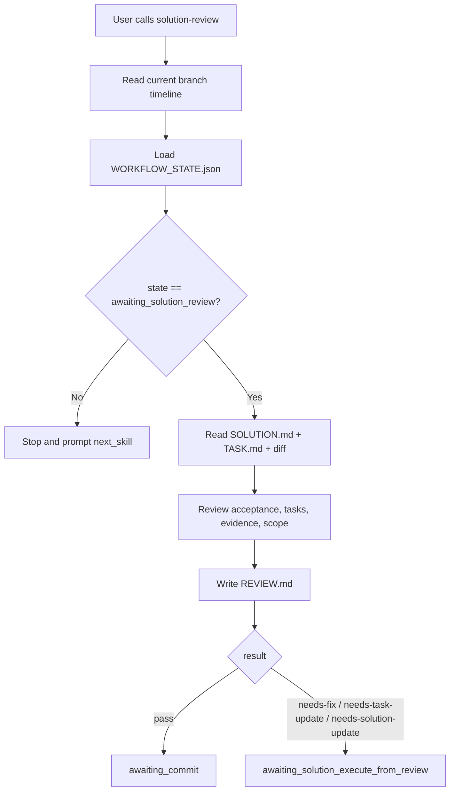

# Solution: Define Solution Review

## Timeline Context

- Stage overview: `.codex/timeline/mvp/workflow-architecture-refactor/STAGE_OVERVIEW.md`
- Loop overview: `.codex/timeline/mvp/workflow-architecture-refactor/MVP_OVERVIEW.md`
- Minimal loop: `solution -> solution-task -> solution-execute -> solution-review`
- Work slice: 004
- Slice type: `feat`
- Branch: `feat/refactor-feature-development`
- Timeline path: `.codex/timeline/feat/refactor-feature-development/`

## Type Decision

- Discussion confirmed type: `feat`
- User correction: none
- Branch type: `feat`
- Selected type: `feat`
- Confidence: high
- Reason: 本 slice 新增 `solution-review` workflow 能力，是 solution 最小闭环的最后一段。
- Alternatives considered: `refactor` 不合适，因为不是调整旧 `review` 行为，而是在其原型基础上新增独立 solution 链路审查阶段。

## Branch Rename Checkpoint

- Current branch: `feat/refactor-feature-development`
- Selected type: `feat`
- Suggested branch: `feat/refactor-feature-development`
- Rename needed: no
- Reason: 当前分支仍覆盖 workflow architecture refactor 的 solution 最小闭环。
- Delivery action: 无

## Goal

新增 `$porter-codex-plugin:solution-review`，以现有 `$porter-codex-plugin:review` / `$porter-codex-plugin:review-branch` 为原型，定义新 solution workflow 的审查阶段。

它读取当前分支 timeline 的 `SOLUTION.md`、`TASK.md`、执行后的实现改动和 `WORKFLOW_STATE.json`，产出 `REVIEW.md`。review 只记录诊断结论和下一步状态，不直接执行修复、不提交、不 merge / push / create PR。

## Problem

旧 `review` / `review-branch` 的核心行为是提交前审查，但它们：

- 读取旧 `plan/<type>/<branch-name>/PLAN.md` / `TASK.md` / `ANALYSIS.md` 作为规划上下文。
- 主要在对话中输出 findings、open questions 和 summary。
- 是可选审查环节，不强制写入一个 workflow review 文件。
- 下一步通常是旧 `commit` / `commit-branch`。

新 solution 最小闭环需要一个独立审查阶段：

```text
solution -> solution-task -> solution-execute -> solution-review
```

`solution-review` 必须把审查结论写入：

```text
.codex/timeline/<branch-type>/<branch-name>/REVIEW.md
```

并根据结论更新：

```text
.codex/timeline/<branch-type>/<branch-name>/WORKFLOW_STATE.json
```

这样 `solution-execute` 可以在 review 发现问题时进入回修模式，而不是让 review 自己改文件。

## Context Read

- [x] `AGENTS.md`
- [x] `.codex/constitution.md`
- [x] `.codex/timeline/mvp/workflow-architecture-refactor/STAGE_OVERVIEW.md`
- [x] `.codex/timeline/mvp/workflow-architecture-refactor/MVP_OVERVIEW.md`
- [x] `plugins/porter-codex-plugin/skills/solution/SKILL.md`
- [x] `plugins/porter-codex-plugin/skills/solution-task/SKILL.md`
- [x] `plugins/porter-codex-plugin/skills/solution-execute/SKILL.md`
- [x] `plugins/porter-codex-plugin/skills/review/SKILL.md`
- [x] `plugins/porter-codex-plugin/skills/review-branch/SKILL.md`

## Scope

### In

- 新增 `plugins/porter-codex-plugin/skills/solution-review/SKILL.md`。
- 明确 `solution-review` 以旧 `review` / `review-branch` 为原型，但只服务新 solution timeline。
- 明确 review 输入：
  - `.codex/timeline/<branch-type>/<branch-name>/SOLUTION.md`
  - `.codex/timeline/<branch-type>/<branch-name>/TASK.md`
  - `.codex/timeline/<branch-type>/<branch-name>/WORKFLOW_STATE.json`
  - 当前工作区 diff
  - 必要时读取已有 `.codex/timeline/<branch-type>/<branch-name>/REVIEW.md`
- 明确 review 输出：
  - `.codex/timeline/<branch-type>/<branch-name>/REVIEW.md`
  - `.codex/timeline/<branch-type>/<branch-name>/WORKFLOW_STATE.json`
- 定义 review 结论：
  - `pass`
  - `needs-fix`
  - `needs-task-update`
  - `needs-solution-update`
- 明确 review 本身不直接修复。
- 明确 `pass` 后进入 `awaiting_commit`。
- 明确 `needs-fix` / `needs-task-update` / `needs-solution-update` 后进入 `awaiting_solution_execute_from_review`。

### Out

- 不修改旧 `review` / `review-branch`。
- 不读取旧 `plan/<type>/<branch-name>/PLAN.md`。
- 不读取旧 `plan/<type>/<branch-name>/ANALYSIS.md`。
- 不读取旧 `plan/` workflow state。
- 不修改实现文件。
- 不更新 `TASK.md` 或 `SOLUTION.md`；如果需要，交给回修模式的 `solution-execute`。
- 不实现 Git delivery 生命周期。
- 不 commit、merge、push 或 create PR。
- 不处理 worktree 并行模式。
- 不引入额外状态流。

## Type-Specific Analysis

### 功能目标

定义 `solution-review` 入口和 `REVIEW.md` 输出规范，让 solution 最小闭环可以完成审查并决定进入提交、回修或重新确认范围。

### 用户价值

用户完成 `$porter-codex-plugin:solution-execute` 后，可以显式调用 `$porter-codex-plugin:solution-review` 获得结构化审查结论。结论会留存在 timeline 中，后续提交或回修都有可追溯依据。

### 功能边界

做：

- 读取本轮 solution / task / diff / state。
- 审查实现是否满足 `SOLUTION.md` 和 `TASK.md`。
- 写入 `REVIEW.md`。
- 根据结论更新 `WORKFLOW_STATE.json`。
- 需要回修时只切状态，不直接改实现。

不做：

- 不执行修复。
- 不补任务。
- 不改方案。
- 不提交。
- 不接入其他流程。

### 方案设计

新增文件：

```text
plugins/porter-codex-plugin/skills/solution-review/SKILL.md
```

不新增 `reference/*.md`。原因：review 的核心是统一审查入口，type-specific 验证节奏已经体现在 `SOLUTION.md`、`TASK.md` 和 `solution-execute/reference/*.md` 中；为保持简单，本 slice 先把 review 规则集中在单个 `SKILL.md`。

`solution-review/SKILL.md` 负责：

1. 确认当前不在 `main` / `master`。
2. 解析 `<branch-type>/<branch-name>`。
3. 读取 `.codex/timeline/<branch-type>/<branch-name>/WORKFLOW_STATE.json`。
4. 只允许从 `awaiting_solution_review` 进入。
5. 读取 `SOLUTION.md`、`TASK.md` 和当前 diff。
6. 按审查清单检查目标、任务、实现、验证证据和阶段边界。
7. 写入 `REVIEW.md`。
8. 根据结论写入下一状态。

### Review Mechanism

沿用旧 `review` / `review-branch` 的双层审查机制：

1. 当前 Codex 负责整理 review brief，并裁决业务语义、solution workflow 阶段边界、`SOLUTION.md` / `TASK.md` 一致性、AGENTS.md / constitution 规则和最终状态流。
2. 如果用户显式调用 `$porter-codex-plugin:solution-review`，且当前环境支持 `code-reviewer` 子代理或等价的新上下文审查能力，则使用子代理审查 review brief 和 diff。
3. 子代理只做通用工程审查，例如 JSON / Markdown / frontmatter 是否明显不可运行、状态不一致、遗漏验证、命名不一致、历史路径残留、危险命令、权限边界和 secret 风险。
4. 子代理不裁决业务意图、配置取舍、workflow 阶段边界、是否升级范围，或任何需要当前长上下文和用户历史要求才能判断的问题。
5. 当前 Codex 合并结果，只保留有文件事实或 diff 支撑的问题；证据不足但需要用户判断的问题降级为 Open Questions。
6. 如果环境不支持子代理，降级为当前 Codex 按同一审查清单完成审查，并在 `REVIEW.md` 的 Notes 中记录原因。

首次正常 review 默认按双层审查执行。

回修后的 review 先复查上一轮 `REVIEW.md` findings 是否解决；如果回修 diff 较大、涉及可执行行为、用户显式要求，或当前 Codex 判断通用工程风险较高，则再次使用子代理。若回修范围很小且未调用子代理，必须在 `REVIEW.md` 的 Notes 中记录跳过原因。

### Review Conclusions

`REVIEW.md` 必须记录一个主结论：

| Conclusion | Meaning | Next state |
| --- | --- | --- |
| `pass` | 满足验收，未发现阻断提交问题 | `awaiting_commit` |
| `needs-fix` | 实现有缺陷，需要回修 | `awaiting_solution_execute_from_review` |
| `needs-task-update` | 任务拆分或验证缺口需要补齐 | `awaiting_solution_execute_from_review` |
| `needs-solution-update` | 方案假设、验收、根因或瓶颈判断需要更新 | `awaiting_solution_execute_from_review` |

如果 review 发现当前结果已经超出原 solution 范围，不新增独立状态；应记录为 `needs-solution-update`，在 `Findings` 或 `Open Questions` 中说明需要用户重新确认范围，并让后续 `$porter-codex-plugin:solution-execute` 回修或停止等待用户确认。

### REVIEW.md Structure

建议结构：

```markdown
# Review: <title>

## Timeline Context

- Solution: `.codex/timeline/<branch-type>/<branch-name>/SOLUTION.md`
- Task: `.codex/timeline/<branch-type>/<branch-name>/TASK.md`
- Branch: `<branch-type>/<branch-name>`
- Type: `<selected-type>`
- Work slice: `<slice>`

## Result

<pass | needs-fix | needs-task-update | needs-solution-update>

## Checks

- <结构、状态、验证命令或审查项>

## Findings

- <按 P0/P1/P2/P3 排序；没有则写无阻断问题>

## Open Questions

- <需要用户确认的问题；没有则写无>

## Notes

- <非阻断观察>

## Next Step

<下一步显式 skill>
```

### Review Checklist

必须检查：

- `SOLUTION.md` 的目标、范围和验收是否仍然成立。
- `TASK.md` 是否全部完成，或未完成项是否合理记录。
- `TASK.md` 中每个完成任务是否有验证证据或限制说明。
- 当前 diff 是否只包含本 slice 允许范围。
- 新增或修改文件是否符合 Codex 插件路径边界。
- 是否误改旧 `plan-*`、`execute-*`、`review-*` 或 Claude 侧配置。
- Markdown frontmatter 是否有效。
- JSON 示例或状态文件是否可解析。
- Markdown 代码围栏是否平衡。
- 当前 workflow state 是否能正确进入下一阶段。

### State Outputs

`pass` 输出：

```json
{
  "state": "awaiting_commit",
  "current_skill": "$porter-codex-plugin:solution-review",
  "next_skill": "$porter-codex-plugin:commit",
  "timeline": ".codex/timeline/<branch-type>/<branch-name>",
  "allowed_outputs": [
    ".codex/timeline/<branch-type>/<branch-name>/REVIEW.md",
    ".codex/timeline/<branch-type>/<branch-name>/WORKFLOW_STATE.json"
  ]
}
```

需要回修输出：

```json
{
  "state": "awaiting_solution_execute_from_review",
  "current_skill": "$porter-codex-plugin:solution-review",
  "next_skill": "$porter-codex-plugin:solution-execute",
  "timeline": ".codex/timeline/<branch-type>/<branch-name>",
  "allowed_outputs": [
    ".codex/timeline/<branch-type>/<branch-name>/REVIEW.md",
    ".codex/timeline/<branch-type>/<branch-name>/WORKFLOW_STATE.json"
  ]
}
```

### 接口或配置

唯一入口：

```text
$porter-codex-plugin:solution-review
```

不新增命令参数。

### 数据流

```text
WORKFLOW_STATE.json(awaiting_solution_review)
  -> solution-review
  -> read SOLUTION.md + TASK.md + current diff
  -> write REVIEW.md
  -> write WORKFLOW_STATE.json(next state)
```

### 实现顺序

1. 创建 `solution-review/SKILL.md`。
2. 定义阶段边界、前置条件和 state gate。
3. 定义 review 输入和 `REVIEW.md` 结构。
4. 定义结论和状态输出。
5. 定义审查清单。
6. 运行 skill frontmatter 校验、JSON 校验、Markdown 围栏检查和路径搜索。

## Visual Model



## Proposed Changes

- Add `plugins/porter-codex-plugin/skills/solution-review/SKILL.md`.
- Update `.codex/timeline/feat/refactor-feature-development/TASK.md` in the next `solution-task` stage.
- Update `.codex/timeline/feat/refactor-feature-development/WORKFLOW_STATE.json` in the next stages as the workflow advances.

## Acceptance

- `solution-review` skill frontmatter is valid.
- `solution-review` is documented as based on existing `review` / `review-branch` prototypes.
- `solution-review` carries forward the existing two-layer review mechanism.
- First review uses current Codex plus `code-reviewer` subagent when available.
- Remediation review first verifies prior findings and uses subagent again when diff size, executable behavior, user request, or risk level justifies it.
- `REVIEW.md` records when subagent review is unavailable or intentionally skipped.
- `solution-review` reads `.codex/timeline/<branch-type>/<branch-name>/SOLUTION.md`, `TASK.md`, and `WORKFLOW_STATE.json`.
- `solution-review` does not read old `plan/PLAN.md`, `plan/ANALYSIS.md`, or old `plan/WORKFLOW_STATE.json`.
- `solution-review` only runs from `awaiting_solution_review`.
- `solution-review` writes `REVIEW.md`.
- `REVIEW.md` records `Result`, `Checks`, `Findings`, `Open Questions`, `Notes`, and `Next Step`.
- `solution-review` supports `pass`.
- `solution-review` supports `needs-fix`.
- `solution-review` supports `needs-task-update`.
- `solution-review` supports `needs-solution-update`.
- `pass` transitions to `awaiting_commit`.
- `needs-fix` / `needs-task-update` / `needs-solution-update` transitions to `awaiting_solution_execute_from_review`.
- Scope questions are recorded under `needs-solution-update` as findings or open questions, without introducing an extra state.
- `solution-review` does not modify implementation files.
- `solution-review` does not update `TASK.md` or `SOLUTION.md`; remediation is handled by `solution-execute`.
- `solution-review` does not execute fixes, commit, merge, push, or create PR.
- Implementation does not modify old `review` / `review-branch`.
- Implementation does not introduce extra state flow.

## Risks

- 如果直接复制旧 `review`，容易只在对话中输出 findings，而不写 `REVIEW.md`；本 slice 必须强制写 timeline review 文件。
- 如果 review 直接修复问题，会破坏 `solution-review` 与 `solution-execute` 的职责边界；必须只写结论和状态。
- 如果 pass 后直接提示 commit 但没有写状态，会让后续流程不可追溯；必须更新 `WORKFLOW_STATE.json`。
- 如果 review 额外引入独立范围状态，会让最小闭环变复杂；本 slice 只使用 `needs-solution-update` 承载范围重新确认问题。

## Confirmation

- 已确认当前 feature 只补齐 solution 最小闭环的最后一段 `solution-review`。
- 已确认本 slice 不把 review 接入其他状态体系。
- 已确认 `solution-review` 的原型是现有 `$porter-codex-plugin:review` / `$porter-codex-plugin:review-branch`。
- 已确认 review 本身不直接执行修复，回修交给 `$porter-codex-plugin:solution-execute`。

## Next Step

请确认本方案是否符合预期。若无需调整，请显式调用 `$porter-codex-plugin:solution-task` 生成 slice 004 的 `TASK.md`。
