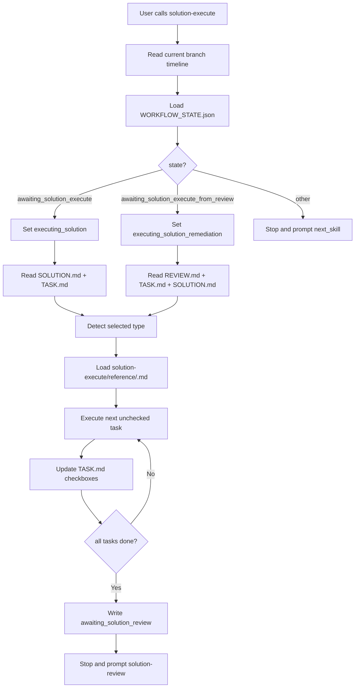

# Solution: Define Solution Execute

## Timeline Context

- Stage overview: `.codex/timeline/mvp/workflow-architecture-refactor/STAGE_OVERVIEW.md`
- MVP overview: `.codex/timeline/mvp/workflow-architecture-refactor/MVP_OVERVIEW.md`
- MVP: 1 - Solution 最小闭环
- Work slice: 003
- Slice type: `feat`
- Branch: `feat/refactor-feature-development`
- Timeline path: `.codex/timeline/feat/refactor-feature-development/`

## Type Decision

- Discussion confirmed type: `feat`
- User correction: none
- Branch type: `feat`
- Selected type: `feat`
- Confidence: high
- Reason: 本 slice 新增 `solution-execute` workflow 能力，是用户可显式调用的新入口。
- Alternatives considered: `refactor` 不合适，因为不是调整旧 `execute` 行为，而是在其原型基础上新增独立 solution 链路执行阶段。

## Branch Rename Checkpoint

- Current branch: `feat/refactor-feature-development`
- Selected type: `feat`
- Suggested branch: `feat/refactor-feature-development`
- Rename needed: no
- Reason: 当前分支仍覆盖 workflow architecture refactor 的 MVP 1 内容闭环。
- Delivery action: 无

## Goal

新增 `$porter-codex-plugin:solution-execute`，以现有 `$porter-codex-plugin:execute` / `$porter-codex-plugin:execute-branch` 为原型，定义新 solution workflow 的执行阶段。

它从当前分支 timeline 的 `SOLUTION.md` 和 `TASK.md` 执行任务，更新任务状态和 workflow state，并在完成后进入 `$porter-codex-plugin:solution-review`。同时，它需要支持 review 回修模式：当 review 发现需要修复、补任务或更新方案时，`solution-execute` 可以读取 `REVIEW.md` 并执行回修，必要时更新 `TASK.md` 或 `SOLUTION.md`。

## Problem

旧 `execute` / `execute-branch` 的输入和状态依赖旧 workflow：

- `plan/<type>/<branch-name>/TASK.md`
- `plan/<type>/<branch-name>/PLAN.md`
- `plan/<type>/<branch-name>/WORKFLOW_STATE.json`
- 状态：`awaiting_execute` / `executing` / `execution_allowed` / `awaiting_review_or_commit`
- 下一步：`review` / `review-branch` 或 `commit` / `commit-branch`

新 solution 链路已经把方案和任务统一到：

```text
.codex/timeline/<branch-type>/<branch-name>/SOLUTION.md
.codex/timeline/<branch-type>/<branch-name>/TASK.md
.codex/timeline/<branch-type>/<branch-name>/REVIEW.md
.codex/timeline/<branch-type>/<branch-name>/WORKFLOW_STATE.json
```

因此 `solution-execute` 需要复用旧 `execute` 的执行节奏和阶段边界，但不能读取旧 `plan/` 输入，也不能进入旧 review / commit 链路。它必须把执行完成后的状态推进到 `awaiting_solution_review`，并为后续 review 回修闭环预留明确状态。

## Context Read

- [x] `AGENTS.md`
- [x] `.codex/constitution.md`
- [x] `.codex/timeline/mvp/workflow-architecture-refactor/STAGE_OVERVIEW.md`
- [x] `.codex/timeline/mvp/workflow-architecture-refactor/MVP_OVERVIEW.md`
- [x] `plugins/porter-codex-plugin/skills/solution/SKILL.md`
- [x] `plugins/porter-codex-plugin/skills/solution-task/SKILL.md`
- [x] `plugins/porter-codex-plugin/skills/solution/reference/feat.md`
- [x] `plugins/porter-codex-plugin/skills/execute/SKILL.md`
- [x] `plugins/porter-codex-plugin/skills/execute-branch/SKILL.md`
- [x] `plugins/porter-codex-plugin/skills/execute/reference/feat.md`
- [x] `plugins/porter-codex-plugin/skills/execute/reference/fix.md`

## Scope

### In

- 新增 `plugins/porter-codex-plugin/skills/solution-execute/SKILL.md`。
- 新增 `plugins/porter-codex-plugin/skills/solution-execute/reference/*.md`，覆盖 `feat`、`fix`、`refactor`、`perf`、`test`、`docs`、`build`、`ci`、`chore`、`style`。
- 明确 `solution-execute` 以旧 `execute` / `execute-branch` 为原型，但只服务新 solution timeline。
- 明确首次执行模式：
  - 输入 `SOLUTION.md`、`TASK.md`、`WORKFLOW_STATE.json`
  - 允许状态 `awaiting_solution_execute` / `executing_solution`
  - 执行前切换为 `executing_solution`
  - 执行后切换为 `awaiting_solution_review`
- 明确 review 回修模式：
  - 输入 `REVIEW.md`、`TASK.md`、必要时读取 `SOLUTION.md`
  - 允许状态 `awaiting_solution_execute_from_review` / `executing_solution_remediation`
  - 回修后切回 `awaiting_solution_review`
  - 可更新 `TASK.md`
  - 只有 review 结论要求更新方案假设、验收、根因或瓶颈时，才可更新 `SOLUTION.md`
- 明确每完成一个 task 或子步骤后更新 `TASK.md` checkbox。
- 明确执行时按 selected type 读取 `solution-execute/reference/<type>.md`。
- 明确执行完成后停止，提示用户显式调用 `$porter-codex-plugin:solution-review`。
- 明确纯文档/配置任务可通过结构审查验证。

### Out

- 不修改旧 `execute` / `execute-branch` / `execute-worktree`。
- 不读取旧 `plan/<type>/<branch-name>/PLAN.md`。
- 不读取旧 `plan/<type>/<branch-name>/ANALYSIS.md`。
- 不读取旧 `plan/` workflow state。
- 不实现 `solution-review`。
- 不实现 `delivery-*` Git 生命周期。
- 不 commit、merge、push 或 create PR。
- 不处理 worktree 并行模式。
- 不引入 MVP 容器目录结构。
- 不在本 slice 实现 hook guard 对 `.codex/timeline/` 的强约束。

## Type-Specific Analysis

### 功能目标

定义 `solution-execute` 入口和 type-specific 执行 reference，让新 solution 链路可以从 `TASK.md` 执行到 review 阶段。

### 用户价值

用户完成 `$porter-codex-plugin:solution-task` 并确认任务后，可以显式调用 `$porter-codex-plugin:solution-execute` 执行任务，而不再回到旧 `plan/` workflow。

review 发现问题后，用户也可以再次调用 `solution-execute` 进入回修执行，而不是让 review 自己改实现。

### 功能边界

做：

- 定义新 skill 的阶段边界、前置检查、状态流和收尾提示。
- 定义首次执行和 review 回修执行两种模式。
- 定义 type-specific 执行节奏 reference。
- 定义允许读写文件边界。
- 定义与旧 `execute` 原型的映射关系。

不做：

- 不真正执行当前 slice 的后续任务。
- 不定义 review 产物结构细节，那属于 `solution-review` slice。
- 不实现 Git delivery 生命周期。
- 不删除旧 execute 系列。

### 方案设计

新增目录：

```text
plugins/porter-codex-plugin/skills/solution-execute/
  SKILL.md
  reference/
    feat.md
    fix.md
    refactor.md
    perf.md
    test.md
    docs.md
    build.md
    ci.md
    chore.md
    style.md
```

`SKILL.md` 负责通用执行控制：

1. 确认当前分支不是 `main` / `master`。
2. 解析 `<branch-type>/<branch-name>`。
3. 读取 `.codex/timeline/<branch-type>/<branch-name>/WORKFLOW_STATE.json`。
4. 根据 state 选择执行模式：
   - `awaiting_solution_execute` -> first execution
   - `awaiting_solution_execute_from_review` -> review remediation
   - `executing_solution` -> 允许继续 first execution
   - `executing_solution_remediation` -> 允许继续 remediation
   - 其他状态停止，并提示 `next_skill`
5. 读取 `SOLUTION.md` 和 `TASK.md`。
6. 从 `SOLUTION.md` 的 `Type Decision` 读取 selected type。
7. 读取 `reference/<type>.md`。
8. 按 `TASK.md` checkbox 顺序执行第一个未完成任务或继续当前 `[~]` 任务。
9. 每完成一项，更新 `TASK.md` 状态。
10. 全部任务完成后写入 `WORKFLOW_STATE.json`，进入 `awaiting_solution_review`。

review 回修模式额外读取 `REVIEW.md`，并根据 review 结论决定：

- 只修实现：修改实现文件并更新 `TASK.md`。
- 需补任务：更新 `TASK.md` 后执行新增或未完成任务。
- 需更新方案：在 review 明确指出方案假设、验收标准、根因或瓶颈变化时，更新 `SOLUTION.md`，再同步 `TASK.md`。
- 需升级 MVP：停止执行，提示回到 MVP discussion，不继续假定修复。

### 原型映射

| 旧 execute 原型 | 新 solution-execute |
| --- | --- |
| `plan/<type>/<branch-name>/TASK.md` | `.codex/timeline/<branch-type>/<branch-name>/TASK.md` |
| `plan/<type>/<branch-name>/PLAN.md` fallback | 不提供 fallback，必须已有 `TASK.md` |
| `plan/<type>/<branch-name>/WORKFLOW_STATE.json` | `.codex/timeline/<branch-type>/<branch-name>/WORKFLOW_STATE.json` |
| `awaiting_execute` | `awaiting_solution_execute` |
| `executing` | `executing_solution` |
| `awaiting_review_or_commit` | `awaiting_solution_review` |
| `review` / `review-branch` | `solution-review` |
| `commit` / `commit-branch` alternate | 不提供 alternate；review 后再进入 commit |
| `execute/reference/<type>.md` | `solution-execute/reference/<type>.md` |

### 接口或配置

唯一入口：

```text
$porter-codex-plugin:solution-execute
```

不新增命令参数。

### 数据流

首次执行：

```text
WORKFLOW_STATE.json(awaiting_solution_execute)
  -> solution-execute
  -> WORKFLOW_STATE.json(executing_solution)
  -> read SOLUTION.md + TASK.md + reference/<type>.md
  -> edit implementation/config/docs and TASK.md
  -> WORKFLOW_STATE.json(awaiting_solution_review)
```

review 回修：

```text
WORKFLOW_STATE.json(awaiting_solution_execute_from_review)
  -> solution-execute
  -> WORKFLOW_STATE.json(executing_solution_remediation)
  -> read REVIEW.md + TASK.md + SOLUTION.md
  -> edit implementation/config/docs, TASK.md, and maybe SOLUTION.md
  -> WORKFLOW_STATE.json(awaiting_solution_review)
```

### 实现顺序

1. 创建 `solution-execute/SKILL.md`，定义入口、边界、路径和状态机。
2. 创建 `solution-execute/reference/*.md`，从旧 `execute/reference/*.md` 迁移执行节奏，移除旧 `plan/` 假设。
3. 在 `SKILL.md` 中定义首次执行模式和 review 回修模式。
4. 定义 `WORKFLOW_STATE.json` 输出示例。
5. 运行 skill frontmatter 校验、JSON 示例校验、Markdown 围栏检查和路径搜索。

## Visual Model



## Proposed Changes

- Add `plugins/porter-codex-plugin/skills/solution-execute/SKILL.md`.
- Add `plugins/porter-codex-plugin/skills/solution-execute/reference/feat.md`.
- Add `plugins/porter-codex-plugin/skills/solution-execute/reference/fix.md`.
- Add `plugins/porter-codex-plugin/skills/solution-execute/reference/refactor.md`.
- Add `plugins/porter-codex-plugin/skills/solution-execute/reference/perf.md`.
- Add `plugins/porter-codex-plugin/skills/solution-execute/reference/test.md`.
- Add `plugins/porter-codex-plugin/skills/solution-execute/reference/docs.md`.
- Add `plugins/porter-codex-plugin/skills/solution-execute/reference/build.md`.
- Add `plugins/porter-codex-plugin/skills/solution-execute/reference/ci.md`.
- Add `plugins/porter-codex-plugin/skills/solution-execute/reference/chore.md`.
- Add `plugins/porter-codex-plugin/skills/solution-execute/reference/style.md`.
- Update `.codex/timeline/feat/refactor-feature-development/TASK.md` in the next `solution-task` stage.
- Update `.codex/timeline/feat/refactor-feature-development/WORKFLOW_STATE.json` in the next stages as the workflow advances.

## Acceptance

- `solution-execute` skill frontmatter is valid.
- `solution-execute` is documented as based on existing `execute` / `execute-branch` prototypes.
- `solution-execute` reads `.codex/timeline/<branch-type>/<branch-name>/SOLUTION.md`, `TASK.md`, and `WORKFLOW_STATE.json`.
- `solution-execute` does not read old `plan/PLAN.md`, `plan/ANALYSIS.md`, or old `plan/WORKFLOW_STATE.json`.
- `solution-execute` refuses to run from unsupported workflow states and prompts the recorded `next_skill`.
- First execution mode supports `awaiting_solution_execute` and `executing_solution`.
- Review remediation mode supports `awaiting_solution_execute_from_review` and `executing_solution_remediation`.
- First execution writes `executing_solution` before modifying implementation/config/docs files.
- Review remediation writes `executing_solution_remediation` before modifying implementation/config/docs files.
- First execution completion writes `awaiting_solution_review`.
- Review remediation completion writes `awaiting_solution_review`.
- `current_skill` and `next_skill` in output state point to `$porter-codex-plugin:solution-execute` and `$porter-codex-plugin:solution-review`.
- `TASK.md` checkbox updates are required after completing tasks.
- `SOLUTION.md` can be updated only in review remediation mode and only when review identifies changed assumptions, acceptance, root cause, or bottleneck analysis.
- `REVIEW.md` is read only in review remediation mode.
- `solution-execute` does not execute review, commit, merge, push, or create PR.
- `solution-execute/reference/*.md` covers all supported types.
- `feat` execution keeps Red / Green / Refactor behavior from the old execute prototype.
- `fix` execution keeps reproduction -> fix -> regression verification from the old execute prototype.
- `perf` execution keeps baseline -> bottleneck -> optimization -> measurement verification.
- Docs/config-only tasks can use structure review as validation.
- Implementation does not modify old `execute-*` skills.
- Implementation does not introduce MVP container structures.

## Risks

- 如果直接复制旧 `execute`，容易保留 `plan/` fallback 或旧 `awaiting_review_or_commit` 状态；本 slice 必须显式移除旧路径和旧状态。
- 如果允许 `solution-execute` 在任意状态下运行，会破坏新 workflow 的阶段边界；必须先检查 `WORKFLOW_STATE.json`。
- review 回修模式允许更新 `SOLUTION.md`，需要严格限定在 review 明确指出方案假设、验收、根因或瓶颈变化时，避免执行阶段随意改方案。
- 当前 MVP 1 还没有 hook guard 强约束 `.codex/timeline/` 写入，执行边界主要靠 skill 文档约束。
- 当前 root timeline 只有一组 `SOLUTION.md` / `TASK.md` / `REVIEW.md`，本 slice 会覆盖上一轮过程文件；当前阶段接受这一点，依赖 Git 提交历史追溯。

## Confirmation

- 已确认 `solution-execute` 的原型是现有 `$porter-codex-plugin:execute` / `$porter-codex-plugin:execute-branch`。
- 已确认本 slice 是在旧 execute 基础上定义新的 solution 链路执行阶段，而不是修改旧 execute。
- 已确认本 slice 需要支持首次执行和 review 回修执行两种模式。
- 已确认本 slice 只定义 `solution-execute`，不顺手实现 `solution-review`。

## Next Step

请确认本方案是否符合预期。若无需调整，请显式调用 `$porter-codex-plugin:solution-task` 生成 slice 003 的 `TASK.md`。
