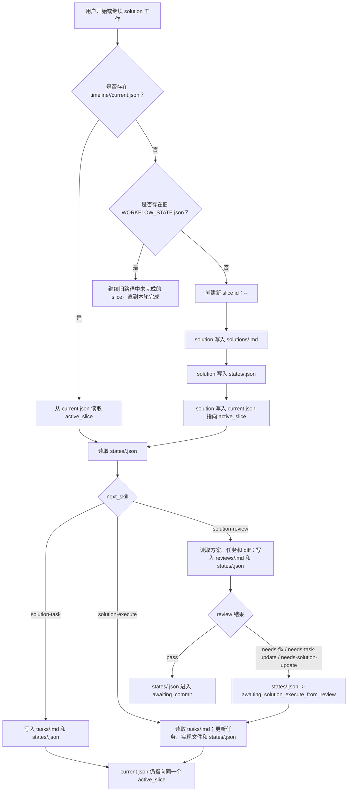

# 方案：定义 Timeline Slice 记录模型

## Timeline 上下文

- 阶段总览：`.codex/timeline/mvp/workflow-architecture-refactor/STAGE_OVERVIEW.md`
- MVP 总览：`.codex/timeline/mvp/workflow-architecture-refactor/MVP_OVERVIEW.md`
- 最小闭环：`solution -> solution-task -> solution-execute -> solution-review`
- 工作切片：`005`
- 切片类型：`feat`
- 当前分支：`feat/refactor-feature-development`
- 当前旧 timeline 路径：`.codex/timeline/feat/refactor-feature-development/`

## 类型判断

- 讨论确认类型：`feat`
- 用户纠偏：无
- 分支类型：`feat`
- 选定类型：`feat`
- 置信度：高
- 理由：本切片定义新的 timeline container 与 slice record 路由，是 solution workflow 的新增结构能力。
- 备选考虑：`refactor` 不合适，因为目标不是单纯整理现有文件，而是定义后续 workflow 必须使用的新路径模型和状态读写规则。

## 分支重命名检查点

- 当前分支：`feat/refactor-feature-development`
- 选定类型：`feat`
- 建议分支：`feat/refactor-feature-development`
- 是否需要重命名：否
- 理由：当前分支仍覆盖 workflow architecture refactor 的 solution 最小闭环。
- 交付动作：无

## 目标

定义统一的 timeline container 与 slice record 文件模型，避免当前 `.codex/timeline/<branch-type>/<branch-name>/SOLUTION.md`、`TASK.md`、`REVIEW.md`、`WORKFLOW_STATE.json` 在同一分支连续执行多个 solution 时互相覆盖。

新模型应让小 feature 和长期 MVP timeline 使用同一套路径规则：

```text
.codex/timeline/<timeline-name>/
  <timeline-name>-overview.md
  current.json
  solutions/<slice-id>-<type>-<slug>.md
  tasks/<slice-id>-<type>-<slug>.md
  reviews/<slice-id>-<type>-<slug>.md
  states/<slice-id>-<type>-<slug>.json
```

## 问题

当前 MVP 1 已定义并实现了 `solution`、`solution-task`、`solution-execute`、`solution-review`，但这些 skill 仍围绕旧路径：

```text
.codex/timeline/<branch-type>/<branch-name>/
  SOLUTION.md
  TASK.md
  REVIEW.md
  WORKFLOW_STATE.json
```

这个路径有两个问题：

- 同一分支上连续做多个 solution slice 时，固定文件名会覆盖上一轮 `SOLUTION.md` / `TASK.md` / `REVIEW.md` / `WORKFLOW_STATE.json`。
- `<branch-type>/<branch-name>` 把 Git type 作为目录层级，不适合后续 MVP timeline；MVP 应是一个 container overview，内部继续拆 `feat`、`fix`、`perf`、`docs` 等 slice，而不是把 `mvp` 当作 solution type。

005 需要先把文件模型和读写规则定义清楚，再让后续 slice 去修改各个 skill 的实际路径实现。

## 已读取上下文

- [x] `AGENTS.md`
- [x] `.codex/constitution.md`
- [x] `.codex/timeline/mvp/workflow-architecture-refactor/STAGE_OVERVIEW.md`
- [x] `.codex/timeline/mvp/workflow-architecture-refactor/MVP_OVERVIEW.md`
- [x] `plugins/porter-codex-plugin/skills/solution/SKILL.md`
- [x] 用户确认的路径方向：
  - 统一使用 timeline container。
  - MVP 只有 overview；MVP 内部的后续工作仍拆成 `feat`、`fix`、`perf`、`docs` 等 slice。
  - 小 feature 也走统一结构，不单独维护另一套路由。

## 范围

### 做

- 定义新的 timeline container 路径结构。
- 定义 slice record 命名规则：`<slice-id>-<type>-<slug>`。
- 定义小 feature 与 MVP timeline 的统一示例。
- 定义 `current.json` 的职责。
- 定义 `states/*.json` 与当前 `WORKFLOW_STATE.json` 的关系。
- 定义每个阶段的文件读写边界。
- 定义旧路径在途 slice 收尾和迁移边界。
- 同步 `.codex/timeline/mvp/workflow-architecture-refactor/MVP_OVERVIEW.md` 中 005 / 006 及后续候选顺序。
- 执行完成后更新当前 slice 的 `WORKFLOW_STATE.json`，让下一步进入 `solution-review`。

### 不做

- 本 slice 不迁移已有 timeline 文件到新目录。
- 本 slice 不修改 `solution`、`solution-task`、`solution-execute`、`solution-review` 的实现。
- 本 slice 不重写 `MVP_OVERVIEW.md` 的所有历史状态，只同步与当前路径模型和下一步 slice 相关的候选项。
- 本 slice 不实现 `delivery-*` Git 生命周期。
- 本 slice 不引入 `mvp` 作为 slice type。
- 本 slice 不删除旧路径文件。
- 本 slice 不处理 worktree 并行模式。

## 类型分析

### 功能行为

新增一个可被后续 skill 使用的 timeline 文件模型：

```text
.codex/timeline/<timeline-name>/
  <timeline-name>-overview.md
  current.json
  solutions/
  tasks/
  reviews/
  states/
```

其中：

- `<timeline-name>` 是 timeline container 名称，默认来自 branch name 的 slug，长期 MVP 也使用自己的 timeline name。
- `<timeline-name>-overview.md` 是可选 overview；长期 MVP 或多 slice timeline 应使用它，小 feature 可以没有 overview。
- `current.json` 指向当前 active slice。
- `solutions/` 保存所有 slice 的方案文件。
- `tasks/` 保存所有 slice 的任务文件。
- `reviews/` 保存所有 slice 的审查文件。
- `states/` 保存每个 slice 的状态文件。

### Slice 记录命名

每个 slice 使用同一个 record id：

```text
<slice-id>-<type>-<slug>
```

规则：

- `<slice-id>` 是三位递增编号，例如 `001`、`002`、`003`。
- `<type>` 只能是现有 Conventional Commit 类型：
  - `feat`
  - `fix`
  - `refactor`
  - `perf`
  - `test`
  - `docs`
  - `build`
  - `ci`
  - `chore`
  - `style`
- `<slug>` 使用 kebab-case，描述本 slice 目标。
- `mvp` 不是 slice type；MVP 是 timeline container + overview。

同一个 slice 的文件路径：

```text
.codex/timeline/<timeline-name>/solutions/<slice-id>-<type>-<slug>.md
.codex/timeline/<timeline-name>/tasks/<slice-id>-<type>-<slug>.md
.codex/timeline/<timeline-name>/reviews/<slice-id>-<type>-<slug>.md
.codex/timeline/<timeline-name>/states/<slice-id>-<type>-<slug>.json
```

### 小 Feature 示例

小 feature 也使用统一结构，不使用固定 `SOLUTION.md`：

```text
.codex/timeline/fix-review-untracked-files/
  current.json
  solutions/001-fix-review-untracked-files.md
  tasks/001-fix-review-untracked-files.md
  reviews/001-fix-review-untracked-files.md
  states/001-fix-review-untracked-files.json
```

如果小 feature 后续变大，可以直接新增 slice：

```text
.codex/timeline/fix-review-untracked-files/
  current.json
  solutions/001-fix-review-untracked-files.md
  tasks/001-fix-review-untracked-files.md
  reviews/001-fix-review-untracked-files.md
  states/001-fix-review-untracked-files.json
  solutions/002-docs-review-flow.md
  tasks/002-docs-review-flow.md
  reviews/002-docs-review-flow.md
  states/002-docs-review-flow.json
```

### MVP Timeline 示例

MVP 是 timeline container，不是 slice type：

```text
.codex/timeline/workflow-architecture-refactor/
  workflow-architecture-refactor-overview.md
  current.json
  solutions/001-feat-solution.md
  tasks/001-feat-solution.md
  reviews/001-feat-solution.md
  states/001-feat-solution.json
  solutions/002-feat-solution-task.md
  tasks/002-feat-solution-task.md
  reviews/002-feat-solution-task.md
  states/002-feat-solution-task.json
  solutions/003-feat-solution-execute.md
  tasks/003-feat-solution-execute.md
  reviews/003-feat-solution-execute.md
  states/003-feat-solution-execute.json
  solutions/004-feat-solution-review.md
  tasks/004-feat-solution-review.md
  reviews/004-feat-solution-review.md
  states/004-feat-solution-review.json
  solutions/005-feat-timeline-slice-records.md
  tasks/005-feat-timeline-slice-records.md
  reviews/005-feat-timeline-slice-records.md
  states/005-feat-timeline-slice-records.json
```

### current.json

`current.json` 是 timeline container 的当前指针，不替代 slice state。

建议结构：

```json
{
  "timeline": ".codex/timeline/<timeline-name>",
  "active_slice": "<slice-id>-<type>-<slug>",
  "solution": ".codex/timeline/<timeline-name>/solutions/<slice-id>-<type>-<slug>.md",
  "task": ".codex/timeline/<timeline-name>/tasks/<slice-id>-<type>-<slug>.md",
  "review": ".codex/timeline/<timeline-name>/reviews/<slice-id>-<type>-<slug>.md",
  "state": ".codex/timeline/<timeline-name>/states/<slice-id>-<type>-<slug>.json"
}
```

规则：

- `solution` 创建或选择 active slice 时写入 `current.json`。
- `solution-task`、`solution-execute`、`solution-review` 优先从 `current.json` 解析 active slice 文件。
- 如果用户显式指定 slice id，后续可以允许切换 `current.json`，但本 slice 不实现切换命令。
- `current.json` 只记录指针，不记录完整 workflow 状态。

### states/*.json

每个 slice 使用独立 state 文件：

```text
.codex/timeline/<timeline-name>/states/<slice-id>-<type>-<slug>.json
```

它承接当前 `WORKFLOW_STATE.json` 的职责：

```json
{
  "state": "awaiting_solution_task",
  "current_skill": "$porter-codex-plugin:solution",
  "next_skill": "$porter-codex-plugin:solution-task",
  "timeline": ".codex/timeline/<timeline-name>",
  "active_slice": "<slice-id>-<type>-<slug>",
  "solution": ".codex/timeline/<timeline-name>/solutions/<slice-id>-<type>-<slug>.md",
  "task": ".codex/timeline/<timeline-name>/tasks/<slice-id>-<type>-<slug>.md",
  "review": ".codex/timeline/<timeline-name>/reviews/<slice-id>-<type>-<slug>.md",
  "allowed_outputs": [
    ".codex/timeline/<timeline-name>/solutions/<slice-id>-<type>-<slug>.md",
    ".codex/timeline/<timeline-name>/states/<slice-id>-<type>-<slug>.json",
    ".codex/timeline/<timeline-name>/current.json"
  ]
}
```

旧字段 `timeline` 继续存在，但含义变为 timeline container 路径，而不是旧 `<branch-type>/<branch-name>` 目录。

### 阶段写入边界

`solution` 只能写：

```text
.codex/timeline/<timeline-name>/solutions/<slice-id>-<type>-<slug>.md
.codex/timeline/<timeline-name>/states/<slice-id>-<type>-<slug>.json
.codex/timeline/<timeline-name>/current.json
```

`solution-task` 只能写：

```text
.codex/timeline/<timeline-name>/tasks/<slice-id>-<type>-<slug>.md
.codex/timeline/<timeline-name>/states/<slice-id>-<type>-<slug>.json
.codex/timeline/<timeline-name>/current.json
```

`solution-execute` 首次执行可写：

```text
.codex/timeline/<timeline-name>/tasks/<slice-id>-<type>-<slug>.md
.codex/timeline/<timeline-name>/states/<slice-id>-<type>-<slug>.json
<files required by unchecked task items>
```

`solution-execute` 回修执行可写：

```text
.codex/timeline/<timeline-name>/solutions/<slice-id>-<type>-<slug>.md
.codex/timeline/<timeline-name>/tasks/<slice-id>-<type>-<slug>.md
.codex/timeline/<timeline-name>/states/<slice-id>-<type>-<slug>.json
<files required by REVIEW.md remediation>
```

`solution-review` 只能写：

```text
.codex/timeline/<timeline-name>/reviews/<slice-id>-<type>-<slug>.md
.codex/timeline/<timeline-name>/states/<slice-id>-<type>-<slug>.json
```

### 旧路径在途收尾规则

006 改造 skill 路由时，不为新 slice 继续创建旧路径文件。旧路径只用于让当前已经开始的在途 slice 完成：

```text
.codex/timeline/<branch-type>/<branch-name>/SOLUTION.md
.codex/timeline/<branch-type>/<branch-name>/TASK.md
.codex/timeline/<branch-type>/<branch-name>/REVIEW.md
.codex/timeline/<branch-type>/<branch-name>/WORKFLOW_STATE.json
```

新 slice 创建必须使用新路径。

收尾规则：

- 如果 `current.json` 存在，必须优先使用新路径。
- 如果 `current.json` 不存在，但旧 `WORKFLOW_STATE.json` 存在，可以继续当前旧 slice，直到本轮完成。
- 旧路径收尾完成后，后续新 slice 不再写入固定 `SOLUTION.md` / `TASK.md` / `REVIEW.md` / `WORKFLOW_STATE.json`。
- 不自动迁移旧文件。
- 不删除旧文件。
- 如需迁移历史 timeline，后续单独拆迁移 slice。

## 可视化模型



读图方式：

- `current.json` 决定当前 timeline container 中哪个 slice 是活跃的。
- `states/<slice>.json` 决定下一步应该调用哪个 skill。
- `solutions/`、`tasks/`、`reviews/` 按 slice id 追加记录，后续 slice 不覆盖前面的 slice。
- 旧固定文件只在没有 `current.json` 且已有旧 slice 正在进行时继续使用。

## 计划变更

本 slice 只在当前 timeline 中定义新模型：

- 更新当前 `SOLUTION.md`，写入 timeline container 与 slice record 规则。
- 更新 MVP overview，使 005 表达 timeline container / slice record 模型，使 006 表达四个 solution skill 的实际路由改造，并顺延原初始化类审计任务。
- 使用当前 `TASK.md` 执行结构审查检查项。
- 执行完成后更新当前 `WORKFLOW_STATE.json` 为 `awaiting_solution_review`。

后续实现 slice 可能修改：

- `plugins/porter-codex-plugin/skills/solution/SKILL.md`
- `plugins/porter-codex-plugin/skills/solution-task/SKILL.md`
- `plugins/porter-codex-plugin/skills/solution-execute/SKILL.md`
- `plugins/porter-codex-plugin/skills/solution-review/SKILL.md`
- `.codex/timeline/mvp/workflow-architecture-refactor/MVP_OVERVIEW.md`

## 验收标准

- 新路径模型使用 `.codex/timeline/<timeline-name>/`。
- Slice 文件分别存放在 `solutions/`、`tasks/`、`reviews/` 和 `states/` 下。
- Slice record id 使用 `<slice-id>-<type>-<slug>`。
- `mvp` 不作为 slice type。
- MVP 由 timeline container 内的 `<timeline-name>-overview.md` 表达。
- 小 feature 与 MVP timeline 使用同一套目录结构。
- `current.json` 指向 active slice，不替代 slice state。
- `states/*.json` 替代新 slice 中固定的 `WORKFLOW_STATE.json`。
- 每个阶段的写入边界必须明确。
- 旧 `.codex/timeline/<branch-type>/<branch-name>/` 路径只允许当前在途 slice 收尾，不作为新 slice 的创建路径。
- 本 slice 不删除或迁移任何已有 timeline 文件。
- 本 slice 不实现 `delivery-*` Git 生命周期。
- MVP overview 中 006 对齐为实现 `current.json` / `states/*.json` 路由的 slice，原 `constitution` / `codex-md` 审计顺延。

## 风险

- 如果 `current.json` 和 `states/*.json` 职责重叠，后续 skill 可能出现状态漂移；本方案把“指针”和“workflow 状态”分开。
- 如果小 feature 使用特殊扁平路径，后续升级为多 slice 或 MVP 时会需要迁移；本方案让所有 timeline 复用同一结构。
- 如果立即迁移历史文件，当前进行中的 timeline 可能被打断；本方案先定义模型，不立刻迁移。
- 如果把 `mvp` 当作 slice type，MVP overview 和具体 slice 工作会混在一起；本方案将 MVP 保持为 container 层概念。

## 确认记录

- 已确认不再继续使用固定 `SOLUTION.md` / `TASK.md` / `REVIEW.md` / `WORKFLOW_STATE.json` 作为未来新 slice 的主模型。
- 已确认 `mvp` 不作为 slice type；MVP 由 overview 描述，里面继续拆 `feat`、`fix`、`perf`、`docs` 等 slice。
- 已确认小 feature 也使用统一 `solutions/`、`tasks/`、`reviews/`、`states/` 结构。
- 已确认 005 先定义模型，不立即迁移旧文件。

## 下一步

执行完成后进入 `$porter-codex-plugin:solution-review`，审查本 slice 的模型定义、MVP overview 同步和状态流是否一致。
