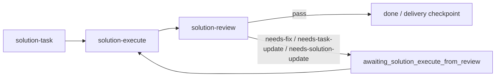

# MVP Overview: MVP 1 Solution Loop

## Parent Stage

- Stage overview: `.codex/timeline/mvp/workflow-architecture-refactor/STAGE_OVERVIEW.md`
- MVP: 1
- MVP name: Solution 最小闭环

## MVP Goal

新增一套独立的 solution 内容最小闭环，让小 feature、小 fix、小 perf/test/docs/build 等需求都能先完成方案、任务、执行和审查：

```text
solution -> solution-task -> solution-execute -> solution-review
```

本 MVP 的过程文件统一写入：

```text
.codex/timeline/<timeline-name>/
  <timeline-name>-overview.md
  current.json
  solutions/<slice-id>-<type>-<slug>.md
  tasks/<slice-id>-<type>-<slug>.md
  reviews/<slice-id>-<type>-<slug>.md
  states/<slice-id>-<type>-<slug>.json
```

本 MVP 不实现 `delivery-*` Git 生命周期。`delivery-branch`、`delivery-commit`、`delivery-merge-to-base`、`delivery-push`、`delivery-create-pr` 作为下一轮 MVP 推进。

## Stage Acceptance Served

本 MVP 服务于 Stage roadmap 中 MVP 1 的验收内容：

- 小 feature、小 fix、小 perf/test/docs/build 等需求能走 `solution -> solution-task -> solution-execute -> solution-review`。
- `solution` 默认不要求用户先传 type，而是进入 pre-solution discussion。
- type 由 discussion 产生；用户可用自然语言提出倾向或纠偏，例如"性能相关"、"这个更像 fix"。
- 用户进入 pre-solution discussion 后保持自然对话，只在关键节点输出 checkpoint 小结。
- 只有用户明确确认 type、目标、范围和最终描述，并表达写方案意图后，才写入 timeline。
- solution 文件包含 `Type Decision`、`Type-Specific Analysis`、`Visual Model`、`Confirmation Needed`。
- 不同 type 按 `reference/<type>.md` 选择 Mermaid 或明确无图原因。
- `fix` 的复现、根因、修复方案被纳入 active slice 的 solution 文件，不额外调用旧 `analyze-bug`。
- `perf` 的性能目标、度量方式、基线或采集计划、瓶颈分析和验证标准被纳入 active slice 的 solution 文件。
- `solution-task` 从 active slice 的 solution 文件生成 task 文件，不读取旧 `PLAN.md` / `ANALYSIS.md`。
- `solution-execute` 支持首次执行和 review 回修执行两种模式，并更新 active slice 的 task 文件与 state 文件。
- `solution-review` 产出 active slice 的 review 文件，记录通过、需修复、需补任务或需更新方案等结论；review 本身不直接执行修复。
- `solution` 只提示后续 `delivery-branch` rename checkpoint，不直接创建、切换或重命名分支。
- 前置只依赖 Codex 初始化类能力：`.codex/constitution.md` 与根目录 `AGENTS.md`。
- 旧 `plan-*` / `analyze-bug` 暂时并存，不立即删除，也不作为新 solution 的模板来源。

## Work Overview

当前 MVP 不是直接拆成 task，而是先按工作类型描述需要完成的内容。

| Type | Goal | Acceptance | Status |
| --- | --- | --- | --- |
| feat | 新增 `solution` 入口语义、pre-solution discussion 和 solution 文件通用结构。 | 已定义 `solution` 的入口语义、写入前确认规则、solution 文件结构和 workflow state 基础行为；`current.json` / `states/*.json` 路由由 006 统一接入。 | review-ready |
| feat | 定义 `solution-task`。 | 已定义从 solution 文件生成 task 文件的规则；能根据 type reference 选择任务节奏；每个任务必须有 `验收标准` 和 `验证方式`；不读取旧 `PLAN.md` / `ANALYSIS.md`；active slice 路由由 006 统一接入。 | review-ready |
| feat | 定义 `solution-execute`。 | 支持首次执行和 review 回修执行；首次从 active slice 的 task 文件执行并进入 review；回修时读取 review 文件，可更新实现、task 文件，必要时更新 solution 文件。 | candidate |
| feat | 定义 `solution-review`。 | 产出 active slice 的 review 文件，记录通过、需修复、需补任务或需更新方案等结论；需要修复时只切换状态，不直接执行修复。 | candidate |
| feat | 定义 timeline container 与 slice record 过程记录模型。 | 过程记录写入 `.codex/timeline/<timeline-name>/`；每个 slice 使用 `solutions/`、`tasks/`、`reviews/`、`states/` 下的 `<slice-id>-<type>-<slug>` 文件；`current.json` 指向 active slice。 | candidate |
| feat | 让 solution workflow 使用 timeline slice record 路由。 | `solution` 写入 `current.json`、`solutions/<slice>.md`、`states/<slice>.json`；`solution-task`、`solution-execute`、`solution-review` 通过 `current.json` 读取 active slice；旧路径只允许当前在途 slice 收尾，不再用于新 slice 创建。 | candidate |
| feat | 定义 `solution/reference/*.md` type 模板。 | `feat`、`fix`、`refactor`、`perf`、`test`、`docs`、`build`、`ci`、`chore`、`style` 都有独立 reference 模板。 | review-ready |
| chore | 明确新 solution 内容闭环与旧 workflow 的隔离边界。 | 不重构旧入口；不从旧入口迁移模板；影响范围只限 Codex 插件；命名和路径符合 kebab-case。 | review-ready |
| docs | 更新 Codex workflow 推荐路径说明。 | README 能解释小需求从 `solution` 内容闭环进入，过程记录写入 `.codex/timeline/<timeline-name>/`，并说明 `delivery-*` 与 `solution` 是协同但不强绑定的独立线。 | active |
| test | 定义当前 MVP 的文档配置验证方式。 | frontmatter、路径、链接、阶段边界、timeline 状态流、Visual Model 规则和 sample flow 完成结构审查；Codex 初始化类 `.codex` 路径审计并入本最终验证。 | candidate |

## Execute And Review Loop

`solution-execute` 和 `solution-review` 不是一次性线性流程，而是当前 MVP 1 的可循环闭环：



### Review Responsibility

`solution-review` 的职责是诊断和记录结论，不直接修改实现、active slice 的 task 文件或 solution 文件：

- 读取当前实现、active slice 的 solution / task 文件和本轮验证结果。
- 写入或更新 active slice 的 review 文件。
- 给出 `pass`、`needs-fix`、`needs-task-update`、`needs-solution-update` 等结论。
- 如果需要回修，将 active slice 的 state 文件指向 review 回修执行状态。

### Execute Modes

`solution-execute` 需要支持两种模式：

| Mode | State | Input | Output |
| --- | --- | --- | --- |
| First execution | `awaiting_solution_execute` | active slice 的 solution / task 文件 | 实现任务，更新 task 文件，完成后进入 `awaiting_solution_review` |
| Review remediation | `awaiting_solution_execute_from_review` | active slice 的 review / task 文件，必要时读取 solution 文件 | 修复 review 发现的问题，更新 task 文件，必要时更新 solution 文件，完成后回到 `awaiting_solution_review` |

### Update Rules

- `review` 发现实现缺陷时，只记录问题、证据和建议修复路径。
- `execute` 在 review 回修模式中负责真正修改文件。
- 如果 review 结论只影响任务拆分，回修执行可更新 active slice 的 task 文件。
- 如果 review 结论说明原方案假设、验收标准、根因判断或性能瓶颈判断发生变化，回修执行可同步更新 active slice 的 solution 文件。
- 如果 review 结论说明当前 solution 已经不是单个小需求能承载的范围，则记录为 `needs-solution-update`，在 findings 或 open questions 中说明需要用户重新确认范围。

### Type Examples

- `feat`: review 发现行为测试缺失时，先在 active slice 的 review 文件记录缺口；回修执行补 Red / Green / Refactor 任务和实现。
- `fix`: review 发现根因不成立或复现不完整时，回修执行可补充 active slice 的 task 文件，必要时修正 solution 文件的根因分析。
- `perf`: review 发现基线数据不足或优化无量化收益时，回修执行补基线、优化或验证任务，并在瓶颈判断变化时修正 solution 文件。

## Current Work Type

- Type: docs
- Reason: 当前 007 用于更新 Codex workflow 推荐路径说明，强调 solution 内容闭环、timeline slice record 过程记录和 Git 交付线边界。

## Slice Candidates

后续 slice 需要从本 MVP overview 中选择一个 work type 和 acceptance，再进入适用的 slice workflow。

| Slice | Type | Goal | Acceptance Served | Status |
| --- | --- | --- | --- | --- |
| 001 | feat | 定义 `solution` 入口语义、solution 文件通用结构和 `solution/reference/*.md` 类型模板。 | feature/fix/perf/test/docs/build 都有独立 reference 模板；`fix` 作为分析型 reference 内建复现与根因分析流程；`perf` 作为度量型 reference 内建基线度量与瓶颈分析流程；用户默认不先传 type，而是进入 pre-solution discussion；生成后必须包含 `Type Decision`、`Visual Model` 与 `Confirmation Needed`；生成后只提示 `delivery-branch` rename checkpoint，不直接改分支。 | review-ready |
| 002 | feat | 定义 `solution-task`。 | 从 timeline 的 solution 文件生成 task 文件；不读取旧 `PLAN.md` / `ANALYSIS.md`；不同 type 的任务结构能继承 `solution-task/reference/*.md` 的验证节奏；每个任务必须有 `验收标准` 和 `验证方式`。 | review-ready |
| 003 | feat | 定义 `solution-execute`。 | 支持首次执行和 review 回修执行；首次从 active slice 的 task 文件执行任务并进入 `awaiting_solution_review`；回修时读取 review 文件，可更新实现、task 文件，必要时更新 solution 文件。 | candidate |
| 004 | feat | 定义 `solution-review`。 | 产出 review 文件；能记录 pass、needs-fix、needs-task-update、needs-solution-update 等结论；需要修复时只更新 review 结论和状态，不直接执行修复。 | candidate |
| 005 | feat | 定义 timeline container 与 slice record 文件模型。 | `.codex/timeline/<timeline-name>/` 下通过 `current.json` 指向 active slice；`solutions/`、`tasks/`、`reviews/`、`states/` 分别保存同一 slice 的过程记录；`mvp` 不作为 slice type。 | candidate |
| 006 | feat | 让 solution workflow 使用 timeline slice record 路由。 | `solution` 新建 `current.json`、`solutions/<slice>.md`、`states/<slice>.json`；`solution-task`、`solution-execute`、`solution-review` 从 `current.json` 找 active slice；旧 `.codex/timeline/<branch-type>/<branch-name>/WORKFLOW_STATE.json` 只用于当前在途 slice 收尾，不再用于新 slice 创建。 | candidate |
| 007 | docs | 更新 Codex workflow 推荐路径说明。 | 文档能解释小需求从 `solution` 内容闭环进入，过程记录写入 `.codex/timeline/<timeline-name>/`，并说明 `delivery-*` 与 `solution` 是协同但不强绑定的独立线。 | active |
| 008 | build | 确认新增 solution skills 的插件暴露方式。 | 新增 skill 目录、frontmatter 和插件元数据完整；如 manifest 不需要手动登记则记录原因。 | candidate |
| 009 | test | 做结构审查、样例流程验证和初始化路径审计。 | frontmatter、路径、链接、阶段边界、timeline 状态流和 Visual Model 规则通过审查；`constitution`、`codex-md` 与当前 `.codex` 路径约定一致，如发现不一致再拆出 fix slice。 | candidate |

## Out Of Current MVP

- 不实现 `delivery-branch`、`delivery-commit`、`delivery-merge-to-base`、`delivery-push`、`delivery-create-pr`。
- 不处理 MVP 容器命令。
- 不处理 worktree 并行模式。
- 不删除旧 `plan-*` / `analyze-bug` 入口。
- 不迁移历史规划文件。

## Result

待 MVP 1 完成后填写，并同步更新 `STAGE_OVERVIEW.md` 中 MVP 1 的 Result。
