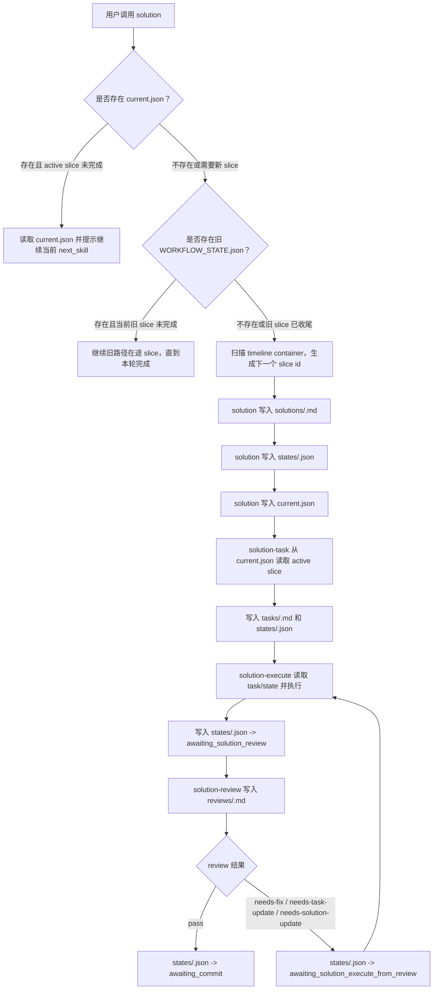
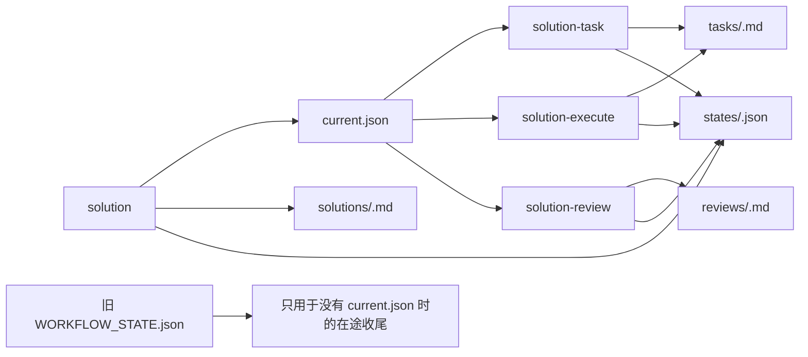

# 方案：让 Solution Workflow 使用 Timeline Slice Record 路由

## Timeline 上下文

- 阶段总览：`.codex/timeline/mvp/workflow-architecture-refactor/STAGE_OVERVIEW.md`
- MVP 总览：`.codex/timeline/mvp/workflow-architecture-refactor/MVP_OVERVIEW.md`
- 最小闭环：`solution -> solution-task -> solution-execute -> solution-review`
- 工作切片：`006`
- Active slice：`006-feat-solution-workflow-slice-record-routing`
- Timeline：`.codex/timeline/refactor-feature-development/`
- 切片类型：`feat`
- 当前分支：`feat/refactor-feature-development`
- 旧 timeline 路径：`.codex/timeline/feat/refactor-feature-development/`，仅保留历史和过渡记录

## 类型判断

- 讨论确认类型：`feat`
- 用户纠偏：无
- 分支类型：`feat`
- 选定类型：`feat`
- 置信度：高
- 理由：本切片让现有四个 solution workflow skill 使用 005 定义的 timeline container、active slice 指针和 slice state 文件，是新增 workflow 能力。
- 备选考虑：`refactor` 不合适，因为目标不是单纯整理文字，而是改变后续 solution workflow 的文件路由行为。

## 分支重命名检查点

- 当前分支：`feat/refactor-feature-development`
- 选定类型：`feat`
- 建议分支：`feat/refactor-feature-development`
- 是否需要重命名：否
- 理由：当前分支仍覆盖 workflow architecture refactor 的 solution 最小闭环。
- 交付动作：无

## 目标

把 `$porter-codex-plugin:solution`、`solution-task`、`solution-execute` 和 `solution-review` 的过程文件路由从固定旧路径：

```text
.codex/timeline/<branch-type>/<branch-name>/
  SOLUTION.md
  TASK.md
  REVIEW.md
  WORKFLOW_STATE.json
```

改为 005 已定义的新模型：

```text
.codex/timeline/<timeline-name>/
  current.json
  solutions/<slice-id>-<type>-<slug>.md
  tasks/<slice-id>-<type>-<slug>.md
  reviews/<slice-id>-<type>-<slug>.md
  states/<slice-id>-<type>-<slug>.json
```

新 slice 必须写入新路径；旧 `.codex/timeline/<branch-type>/<branch-name>/WORKFLOW_STATE.json` 只允许当前在途 slice 收尾，不作为新 slice 创建路径。

## 问题

005 已经定义了 timeline container 与 slice record 文件模型，但四个实际 skill 仍然写固定文件名：

- `solution` 生成 `.codex/timeline/<branch-type>/<branch-name>/SOLUTION.md` 和 `WORKFLOW_STATE.json`。
- `solution-task` 从固定 `SOLUTION.md` 生成固定 `TASK.md`。
- `solution-execute` 读取固定 `TASK.md`，写固定 `WORKFLOW_STATE.json`。
- `solution-review` 写固定 `REVIEW.md` 和固定 `WORKFLOW_STATE.json`。

这会导致两个问题：

- 同一 timeline 内连续做多个 solution slice 时，新一轮会覆盖上一轮的方案、任务、审查和状态。
- MVP timeline 需要通过 overview 组织多个 `feat`、`fix`、`perf`、`docs` 等 slice；如果继续用 `<branch-type>/<branch-name>` 固定路径，就无法稳定表达同一个 timeline 下的多个 slice record。

006 需要把 005 的文件模型真正写进四个 skill 的 Phase Boundary、Prerequisites、State Gate、输出路径、状态 JSON 示例和 completion prompt。

## 已读取上下文

- [x] `AGENTS.md`
- [x] `.codex/constitution.md`
- [x] `.codex/timeline/mvp/workflow-architecture-refactor/MVP_OVERVIEW.md`
- [x] `.codex/timeline/feat/refactor-feature-development/SOLUTION.md` slice 005
- [x] `plugins/porter-codex-plugin/skills/solution/SKILL.md`
- [x] `plugins/porter-codex-plugin/skills/solution-task/SKILL.md`
- [x] `plugins/porter-codex-plugin/skills/solution-execute/SKILL.md`
- [x] `plugins/porter-codex-plugin/skills/solution-review/SKILL.md`
- [x] `plugins/porter-codex-plugin/skills/solution/reference/feat.md`

## 范围

### 做

- 修改 `solution` skill，让新 solution slice 创建或选择 timeline container，并写入：
  - `.codex/timeline/<timeline-name>/current.json`
  - `.codex/timeline/<timeline-name>/solutions/<slice-id>-<type>-<slug>.md`
  - `.codex/timeline/<timeline-name>/states/<slice-id>-<type>-<slug>.json`
- 修改 `solution-task` skill，让它优先从 `current.json` 找 active slice，并写入对应 task 与 state 文件。
- 修改 `solution-execute` skill，让首次执行和 review 回修执行都通过 `current.json` 与 `states/<slice>.json` 定位 solution / task / review 文件。
- 修改 `solution-review` skill，让 review 输入、输出和 pass / remediation 状态都写入 active slice 的 review / state 文件。
- 明确新 slice id 的生成规则：扫描 timeline container 中已有 `solutions/`、`tasks/`、`reviews/`、`states/` 文件的三位编号，取最大值加一；没有记录时从 `001` 开始。
- 明确 `<timeline-name>` 默认来自当前 `<branch-name>` slug；长期 MVP 可以使用自己的 timeline name。
- 明确旧路径在途收尾规则：
  - 如果 `current.json` 存在，必须优先使用新路径。
  - 如果 `current.json` 不存在但旧 `WORKFLOW_STATE.json` 存在，只有旧 state 未完成时才继续当前旧 slice 到完成。
  - 如果旧 `WORKFLOW_STATE.json` 已完成，不能继续旧路径，必须创建新的 timeline slice record。
  - 新 slice 创建必须使用新路径。
- 将当前 006 过程记录写入新的 timeline slice record，作为后续 007 创建的 canonical active slice 基线。
- 保留 `solution-review` 的首次普通 review 子代理机制；只改输入输出路径。

### 不做

- 不迁移历史已完成 slice；本轮只把当前 006 过程记录写入新 timeline container。
- 不删除旧 `.codex/timeline/<branch-type>/<branch-name>/` 文件。
- 不创建除 006 所需 `current.json` 和 slice record 之外的额外 timeline 记录。
- 不实现 MVP 容器管理命令。
- 不引入 `mvp` 作为 slice type。
- 不修改 Claude Code 侧配置。
- 不修改 `$porter-codex-plugin:delivery-*` Git 生命周期。
- 不引入运行时依赖、脚本或构建工具。

## 类型分析

### 功能目标

让 solution 最小闭环从下一轮新 slice 开始使用可追加的 timeline slice record，而不是覆盖固定 `SOLUTION.md` / `TASK.md` / `REVIEW.md` / `WORKFLOW_STATE.json`。

### 用户价值

用户可以在同一个长期 timeline 中连续推进多个小 feature、fix、perf 或 docs slice，并保留每轮 solution、task、execute 和 review 记录。后续 MVP overview 也能只作为 timeline container 的总览，而不是被误当成 slice type。

### 功能边界

做：

- 四个 solution workflow skill 的路径规则、状态规则和输出示例。
- 新路径优先、旧路径在途收尾的判断规则。
- active slice 指针与 slice state 的职责区分。
- 新 slice id 生成和文件映射规则。

不做：

- 自动迁移历史文件。
- 改动真实用户本机配置。
- 扩展 Git delivery。
- 增加可执行 helper 或 runtime。

### 方案设计

核心思路是把路径解析拆成三层规则，写入四个 skill 的说明：

1. Timeline container：
   - 默认路径是 `.codex/timeline/<timeline-name>/`。
   - `<timeline-name>` 默认来自当前 branch name slug，例如 `feat/refactor-feature-development` 对应 `refactor-feature-development`。
   - 长期 MVP timeline 可以使用自己的 timeline name。
2. Active slice 指针：
   - `current.json` 只记录当前 active slice 的文件指针。
   - `solution-task`、`solution-execute`、`solution-review` 必须优先读取 `current.json`。
3. Slice state：
   - `states/<slice-id>-<type>-<slug>.json` 记录 workflow state、next skill 和 allowed outputs。
   - `current.json` 不承载完整 workflow state，避免指针和状态职责混在一起。

`solution` 是唯一能创建新 slice id 的入口。其他三个 skill 只使用 `current.json` 指向的 active slice，不创建新 slice。

旧路径只保留一个收尾分支：当没有 `current.json`，但旧 `WORKFLOW_STATE.json` 已经存在且未完成时，继续旧路径中的当前在途 slice，直到本轮完成。如果旧 state 已完成，不能继续旧路径，后续 new slice 创建必须走新路径。

006 本身已写入新路径，成为当前 `current.json` 指向的 active slice record：

```text
.codex/timeline/refactor-feature-development/current.json
.codex/timeline/refactor-feature-development/solutions/006-feat-solution-workflow-slice-record-routing.md
.codex/timeline/refactor-feature-development/tasks/006-feat-solution-workflow-slice-record-routing.md
.codex/timeline/refactor-feature-development/reviews/006-feat-solution-workflow-slice-record-routing.md
.codex/timeline/refactor-feature-development/states/006-feat-solution-workflow-slice-record-routing.json
```

### 目录结构

本切片计划修改：

```text
plugins/porter-codex-plugin/skills/solution/SKILL.md
plugins/porter-codex-plugin/skills/solution-task/SKILL.md
plugins/porter-codex-plugin/skills/solution-execute/SKILL.md
plugins/porter-codex-plugin/skills/solution-review/SKILL.md
```

本切片不新增真实 runtime 文件；当前 006 的真实 timeline slice record 文件已经写入 `.codex/timeline/refactor-feature-development/`，作为后续 007 的 active slice 基线。

### 接口或配置

对用户入口不新增命令，仍然是：

```text
$porter-codex-plugin:solution
$porter-codex-plugin:solution-task
$porter-codex-plugin:solution-execute
$porter-codex-plugin:solution-review
```

但四个命令的过程文件路径语义变更为：

```text
.codex/timeline/<timeline-name>/current.json
.codex/timeline/<timeline-name>/solutions/<slice>.md
.codex/timeline/<timeline-name>/tasks/<slice>.md
.codex/timeline/<timeline-name>/reviews/<slice>.md
.codex/timeline/<timeline-name>/states/<slice>.json
```

### 数据流



### 实现顺序

1. 更新 `solution/SKILL.md` 的 Phase Boundary、输出路径、新 slice 创建规则、`current.json` / `states/*.json` 示例和收尾提示。
2. 更新 `solution-task/SKILL.md` 的 prerequisites、readiness check、reference routing 输入路径、TASK 输出路径和 state 输出。
3. 更新 `solution-execute/SKILL.md` 的 state gate、first execution mode、review-remediation mode、allowed outputs 和 completion prompt。
4. 更新 `solution-review/SKILL.md` 的 review inputs、review outputs、state outputs、stale review 判断和子代理 review brief 路径。
5. 做结构验证：Markdown 围栏、JSON 示例、frontmatter、路径关键词、旧路径收尾规则、无 Claude 侧改动。

## 可视化模型



## 计划变更

- 更新四个 solution skill 的路径模型，从固定文件切换到 active slice 文件。
- 在四个 skill 中统一写明 `current.json` 优先、旧 `WORKFLOW_STATE.json` 只收尾。
- 在 state JSON 示例中加入或保留必要字段：
  - `state`
  - `current_skill`
  - `next_skill`
  - `timeline`
  - `active_slice`
  - `solution`
  - `task`
  - `review`
  - `allowed_outputs`
- 对 `solution` 额外写明新 slice id 与 slug 生成规则。
- 对 `solution-review` 保留首次普通 review 的 fresh-context 子代理机制。

## 验收标准

- `solution` 不再为新 slice 创建固定 `SOLUTION.md` / `WORKFLOW_STATE.json`，而是写入 `solutions/<slice>.md`、`states/<slice>.json` 和 `current.json`。
- `solution-task`、`solution-execute`、`solution-review` 优先从 `current.json` 解析 active slice 文件；非默认 timeline name 必须有明确解析规则。
- 四个 skill 都明确 `current.json` 存在时必须使用新路径。
- 四个 skill 都明确旧 `.codex/timeline/<branch-type>/<branch-name>/WORKFLOW_STATE.json` 只允许未完成的当前在途 slice 收尾，不用于新 slice 创建。
- 当前 006 过程记录已经写入 `.codex/timeline/refactor-feature-development/` 新路径，`current.json` 指向 006。
- `states/<slice>.json` 的示例包含 active slice 文件路径和 allowed outputs。
- `solution-review` 的 review 子代理机制没有被移除，只更新路径输入输出。
- 不新增 `mvp` 作为 slice type。
- 不修改 Claude Code 侧配置，不引入依赖或构建工具。
- Markdown 围栏平衡，JSON 示例可解析，skill frontmatter 仍有效。
- `rg` 能确认四个 skill 不再把固定旧路径作为新 slice 主模型。

## 风险

- 这是一组 Markdown skill 指令改造，没有共享 helper；四个 skill 的路径术语容易漂移，需要在任务中做交叉关键词审查。
- 旧路径文件仍保留，后续必须以 `.codex/timeline/refactor-feature-development/current.json` 作为 canonical active slice 指针。
- `solution` 的新 slice id 生成依赖扫描已有文件编号；如果后续出现手工命名不规范，需要在 review 中拦截。
- 如果 `current.json` 与 `states/<slice>.json` 同时记录过多状态，后续容易状态漂移；本方案要求 `current.json` 只做指针。

## Confirmation Needed

- 请确认本切片修改 `plugins/porter-codex-plugin/skills/solution*` 四个 skill，并将当前 006 过程记录写入新 timeline container。
- 请确认 `<timeline-name>` 默认来自 branch name slug，例如当前分支对应 `refactor-feature-development`。
- 请确认旧路径规则为“只允许当前在途 slice 收尾”，不是长期兼容输入。
- 请确认 `solution` 是唯一创建新 slice id 的入口，后续三个 skill 只使用 `current.json`。
- 请确认 006 不新增 MVP 容器命令、不新增 `mvp` slice type。

## 下一步

请先确认 `Confirmation Needed`。如果无需调整，请显式调用 `$porter-codex-plugin:solution-task` 生成 slice 006 的任务清单。
