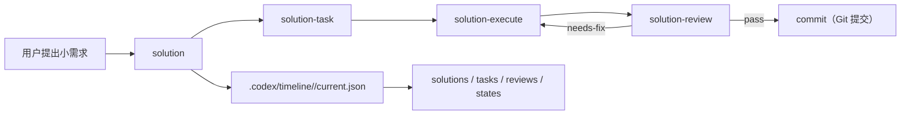

# 方案：更新 Codex solution workflow 推荐路径说明

## Timeline Context

- MVP 总览：`.codex/timeline/mvp/workflow-architecture-refactor/MVP_OVERVIEW.md`
- Timeline：`.codex/timeline/refactor-feature-development/`
- Active slice：`007-docs-solution-workflow-path-guide`
- 最小闭环：`solution -> solution-task -> solution-execute -> solution-review`
- 当前分支：`feat/refactor-feature-development`
- 工作切片：`007`
- 切片类型：`docs`

## Type Decision

- 讨论确认类型：`docs`
- 用户纠偏：将原 007 初始化路径审计并入最终验证，不再单独作为当前 slice
- 分支类型：`feat`
- 选定类型：`docs`
- 置信度：高
- 理由：本 slice 的主要目标是更新面向使用者和维护者的 workflow 推荐路径说明，不新增 skill 行为。
- 备选考虑：`chore` 不合适，因为本轮不是清理配置本身；`feat` 不合适，因为 solution workflow 行为已在 006 接入。

## Branch Rename Checkpoint

- 当前分支：`feat/refactor-feature-development`
- 选定类型：`docs`
- 建议分支：`docs/solution-workflow-path-guide`
- 是否需要重命名：否
- 理由：当前分支承载整个 workflow architecture refactor MVP，继续在同一分支记录本 MVP 后续 slice。
- 交付动作：无

## Goal

更新 Codex 插件文档中的推荐 workflow 说明，让用户能区分：

- 内容闭环：`solution -> solution-task -> solution-execute -> solution-review`
- 过程记录位置：`.codex/timeline/<timeline-name>/current.json` 与 `solutions/`、`tasks/`、`reviews/`、`states/`
- Git 交付线：`delivery-*` / commit / branch 相关能力与 solution 内容闭环协同，但不是强绑定的一条线

同时把原候选 007 的初始化路径审计合并到最终结构验证，不再作为单独 slice。

## Problem

当前 `README.md` 的 Codex 推荐 workflow 仍主要描述旧 `plan` / `task` / `execute` / `review` 与 worktree/branch 线：

- 推荐路径没有说明新的 solution 内容闭环。
- workflow state 说明仍围绕旧 `WORKFLOW_STATE.json` 和 `plan/<type>/<branch-name>/`。
- 用户看 README 时，容易以为新 solution workflow 只是旧 branch/worktree workflow 的替代命令，而不是一套先做内容决策、再进入 Git 交付的独立闭环。
- MVP overview 里原 007 是初始化路径审计；用户已确认该项不单独做，应并入最后验证。

## Context Read

- [x] `AGENTS.md`
- [x] `.codex/constitution.md`
- [x] `README.md`
- [x] `.codex/timeline/mvp/workflow-architecture-refactor/MVP_OVERVIEW.md`
- [x] `.codex/timeline/refactor-feature-development/current.json`
- [x] `.codex/timeline/refactor-feature-development/states/006-feat-solution-workflow-slice-record-routing.json`
- [x] `plugins/porter-codex-plugin/skills/solution/reference/docs.md`
- [x] `plugins/porter-codex-plugin/skills/solution/SKILL.md`
- [x] `plugins/porter-codex-plugin/skills/solution-task/SKILL.md`
- [x] `plugins/porter-codex-plugin/skills/solution-execute/SKILL.md`
- [x] `plugins/porter-codex-plugin/skills/solution-review/SKILL.md`

## Scope

### 做

- 更新 `README.md` 的 Codex workflow 说明，增加 solution 内容闭环推荐路径。
- 说明 solution workflow 的过程记录使用 `.codex/timeline/<timeline-name>/` 新模型。
- 说明 `delivery-*` / commit / branch 相关能力与 solution 内容闭环的关系：协同但不强绑定。
- 同步 `.codex/timeline/mvp/workflow-architecture-refactor/MVP_OVERVIEW.md` 的候选顺序：
  - 原 007 初始化路径审计并入最终验证。
  - docs slice 成为当前 007。
  - 后续候选顺延或按新的编号整理。
- 保持只修改 Codex 插件与本仓库文档，不碰 Claude 插件配置。

### 不做

- 不修改 `plugins/porter-codex-plugin/skills/solution*` 四个 skill 的行为。
- 不实现 `delivery-*` Git 生命周期。
- 不修改 hooks 行为。
- 不删除旧 `plan-*`、`task-*`、`execute-*`、`review-*` 或旧 branch/worktree workflow 说明。
- 不修改 `plugins/porter-claude-plugin/`。
- 不引入运行时依赖、脚本或构建工具。

## Type-Specific Analysis

### 文档目标

让当前仓库使用者和维护者知道：小需求优先进入 solution 内容闭环，过程记录进入 `.codex/timeline/<timeline-name>/`；Git 交付能力是后续独立线，不是 solution workflow 的前置条件。

### 目标读者

- 使用 `porter-codex-plugin` 的 Codex 用户。
- 维护本插件 workflow 文档和 skill 配置的项目协作者。

### 文档结构

计划在 `README.md` 的 Codex 区域补充或调整：

1. Codex solution workflow 推荐入口。
2. Timeline slice record 的过程文件位置。
3. solution 内容闭环与旧 branch/worktree workflow 的关系。
4. Git 交付能力与 solution 内容闭环的协作边界。

计划在 MVP overview 中调整：

1. 将原 007 初始化路径审计合并到最终结构验证。
2. 将当前 docs slice 记录为 007。
3. 保持后续 build/test 候选清晰。

### 内容来源

- `README.md`
- `.codex/timeline/mvp/workflow-architecture-refactor/MVP_OVERVIEW.md`
- `plugins/porter-codex-plugin/skills/solution/SKILL.md`
- `plugins/porter-codex-plugin/skills/solution-task/SKILL.md`
- `plugins/porter-codex-plugin/skills/solution-execute/SKILL.md`
- `plugins/porter-codex-plugin/skills/solution-review/SKILL.md`
- 006 的 active slice record

### 更新范围

- `README.md`
- `.codex/timeline/mvp/workflow-architecture-refactor/MVP_OVERVIEW.md`
- 当前 007 的 task / state / review 文件

### 验收方式

- Markdown 围栏平衡。
- `README.md` 中能看到 solution 内容闭环、timeline slice record 路径和 Git 交付边界。
- MVP overview 中不再把初始化路径审计作为单独 007；该检查并入最终验证候选。
- 文档不声称 `delivery-*` 已在当前 MVP 实现。
- 不出现 `mvp` 作为 slice type。
- `git diff --check` 通过。

## Visual Model

## Proposed Changes

- 更新 `README.md`：
  - 在 Codex 推荐 workflow 中加入 solution 内容闭环。
  - 修正 workflow state 说明中仍偏向旧 `plan/<type>/<branch-name>/WORKFLOW_STATE.json` 的表述。
  - 保留旧 branch/worktree workflow，但明确其与 solution workflow 的关系。
- 更新 `.codex/timeline/mvp/workflow-architecture-refactor/MVP_OVERVIEW.md`：
  - 合并原 007 初始化路径审计到最终验证。
  - 当前 docs slice 使用 007 编号。
  - 后续候选顺延。

## Acceptance

- `README.md` 明确推荐新的 Codex solution 内容闭环：
  - `$porter-codex-plugin:solution`
  - `$porter-codex-plugin:solution-task`
  - `$porter-codex-plugin:solution-execute`
  - `$porter-codex-plugin:solution-review`
- `README.md` 明确过程记录路径为 `.codex/timeline/<timeline-name>/current.json` 和 `solutions/`、`tasks/`、`reviews/`、`states/`。
- `README.md` 明确 Git 交付能力与 solution 内容闭环协同但不强绑定。
- MVP overview 中原 007 初始化路径审计已合并到最终验证，当前 docs slice 是新的 007。
- 文档不修改 Claude Code 侧配置，不引入新依赖。
- Markdown 结构有效，路径和术语与 006 的新模型一致。

## Risks

- `README.md` 同时保留旧 branch/worktree workflow 和新 solution workflow，容易让读者误以为二者互斥；需要明确它们是不同层次。
- 当前 MVP 未实现 `delivery-*`，文档不能把它写成已完成能力。
- 重新编号 slice candidates 时要避免和已提交的 001-006 记录冲突。

## Confirmation Needed

已在对话中确认：

- [x] 原 007 初始化路径审计并入最终结构验证，不再单独作为 slice。
- [x] 当前 docs slice 使用编号 007。
- [x] 本 slice 只更新 `README.md`、MVP overview 和当前 timeline 过程记录，不修改 solution workflow skill 行为。
- [x] README 中强调 solution 内容闭环是“内容决策与执行闭环”，Git commit / delivery 是后续交付线。
- [x] 使用 `commit（Git 提交）` 或 `提交阶段` 这类直白表述，避免误以为当前已经实现完整 delivery workflow。

## Next Step

请先确认 `Confirmation Needed`。如果无需调整，请显式调用 `$porter-codex-plugin:solution-task` 生成任务清单。
