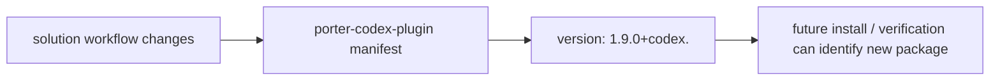

# 方案：更新 Codex 插件版本号

## Timeline Context

- MVP 总览：`.codex/timeline/mvp/workflow-architecture-refactor/MVP_OVERVIEW.md`
- Timeline：`.codex/timeline/refactor-feature-development/`
- Active slice：`008-build-codex-plugin-version-update`
- 最小闭环：`solution -> solution-task -> solution-execute -> solution-review`
- 当前分支：`feat/refactor-feature-development`
- 工作切片：`008`
- 切片类型：`build`

## Type Decision

- 讨论确认类型：`build`
- 用户纠偏：本 slice 收敛为 Codex 插件版本更新；安装验证放到后续 feature 验证或最终 test slice。
- 分支类型：`feat`
- 选定类型：`build`
- 置信度：高
- 理由：本 slice 修改插件打包元数据中的版本号，用于标记 solution workflow 相关变更已进入 Codex 插件包，符合 build 类型。
- 备选考虑：`docs` 不合适，因为主要输出不是使用说明；`test` 不合适，因为真实安装/可见性验证延后到后续验证 slice。

## Branch Rename Checkpoint

- 当前分支：`feat/refactor-feature-development`
- 选定类型：`build`
- 建议分支：`build/codex-plugin-version-update`
- 是否需要重命名：否
- 理由：当前分支承载整个 workflow architecture refactor MVP，继续在同一分支记录本 MVP 后续 slice。
- 交付动作：无

## Goal

更新 `plugins/porter-codex-plugin/.codex-plugin/plugin.json` 中的 Codex 插件版本号，使当前 Codex 插件包元数据能反映 solution workflow 相关变更已进入本分支。

## Problem

当前 solution workflow 已经过 001-007 多个 slice 更新，但 Codex 插件 manifest 版本号仍停留在旧值：

- `plugins/porter-codex-plugin/.codex-plugin/plugin.json`
- 当前版本：`1.8.0+codex.20260617104225`

如果不更新版本，后续安装或同步插件时不容易区分当前包是否包含最新 solution workflow 变更。

用户在 review 阶段确认：本轮 solution workflow 属于新增 Codex workflow 能力，目标版本应提升到 `1.9.0+codex.<timestamp>`，不是只刷新 `1.8.0` 的 build metadata。

## Context Read

- [x] `AGENTS.md`
- [x] `.codex/constitution.md`
- [x] `README.md`
- [x] `.codex/timeline/mvp/workflow-architecture-refactor/MVP_OVERVIEW.md`
- [x] `.codex/timeline/refactor-feature-development/current.json`
- [x] `.codex/timeline/refactor-feature-development/states/007-docs-solution-workflow-path-guide.json`
- [x] `plugins/porter-codex-plugin/.codex-plugin/plugin.json`
- [x] `.agents/plugins/marketplace.json`
- [x] `plugins/porter-codex-plugin/skills/solution/reference/build.md`

## Scope

### 做

- 更新 `plugins/porter-codex-plugin/.codex-plugin/plugin.json` 的 `version` 字段。
- 使用当前日期时间生成新的 Codex build metadata，保持现有版本格式。
- 解析验证 `plugin.json`。
- 同步当前 008 timeline 过程记录。

### 不做

- 不执行真实插件安装验证。
- 不写入用户本机 `~/.codex`。
- 不修改 `.agents/plugins/marketplace.json`，除非版本更新验证发现必要缺口。
- 不修改 `plugins/porter-claude-plugin/`。
- 不同步构造 Claude Code 侧能力。
- 不重构 solution workflow 行为。
- 不新增 runtime 依赖、脚本或构建工具。

## Type-Specific Analysis

### 变更内容

修改：

- `plugins/porter-codex-plugin/.codex-plugin/plugin.json`
  - `version`: 从旧的 `1.8.0+codex.20260617104225` 更新为新的 `1.9.0+codex.<timestamp>`

版本号升级到 `1.9.0`，同时保留 `+codex.<timestamp>` build metadata；不改变 manifest 结构。

### 变更原因

为当前 Codex 插件包元数据打上新的可识别版本，方便后续安装、验证或同步时确认包内容已经包含 solution workflow 系列变更。

### 影响范围

- Codex 插件 manifest 元数据。
- 后续插件安装/同步时的版本识别。
- 当前 timeline 过程记录。

不影响 Claude Code 插件、不影响 skill 行为、不影响 hooks 运行逻辑。

### 兼容性说明

保持既有 `+codex.<timestamp>` build metadata 格式，不改变 marketplace 路径、skills 暴露方式或插件能力声明。

真实安装验证不在本 slice 做；后续 feature 验证或最终 test slice 可把“安装后能看到 solution workflow skills”作为样例流程验证的一部分。

### 验证方式

- `jq` 解析 `plugins/porter-codex-plugin/.codex-plugin/plugin.json`。
- `jq -r .version` 检查版本号符合 `1.9.0+codex.<timestamp>` 格式。
- `git diff --check`。
- `git status --short` 确认不包含 `plugins/porter-claude-plugin/`。

## Visual Model

## Proposed Changes

- 更新 `plugins/porter-codex-plugin/.codex-plugin/plugin.json` 的 `version`。
- 不修改 `skills` 暴露方式。
- 不修改 marketplace。
- 在 task/review 中记录真实安装验证延后到后续 feature/test slice。

## Acceptance

- `plugin.json` 的 `version` 已更新为新的 Codex build metadata。
- `plugin.json` JSON 语法有效。
- 版本格式保持 `1.9.0+codex.<timestamp>`。
- 未修改 `plugins/porter-claude-plugin/`。
- 未引入新依赖、脚本或构建工具。
- 当前 slice 记录明确真实安装验证不在本轮执行，后续验证 slice 再做。

## Risks

- 只更新 build metadata 不等于完成真实安装验证；该验证应放入后续 feature 验证或最终 test slice。
- 如果未来需要同步 Claude Code 插件版本，必须由用户明确要求，不能在本 slice 擅自双端同步。

## Confirmation Needed

- [x] 用户已确认：本 slice 应该只做版本更新工作。
- [x] 用户已确认：安装验证可以放到下个 feature 验证或后续最终验证中。
- [x] 类型选择为 `build`。
- [x] 本 slice 只修改 Codex 插件 manifest 和当前 timeline 过程记录。
- [x] 不修改 `plugins/porter-claude-plugin/`。
- [x] 不安装或写入用户本机 `~/.codex`。

## Next Step

请先确认 `Confirmation Needed`。如果无需调整，请显式调用 `$porter-codex-plugin:solution-task` 生成任务清单。
