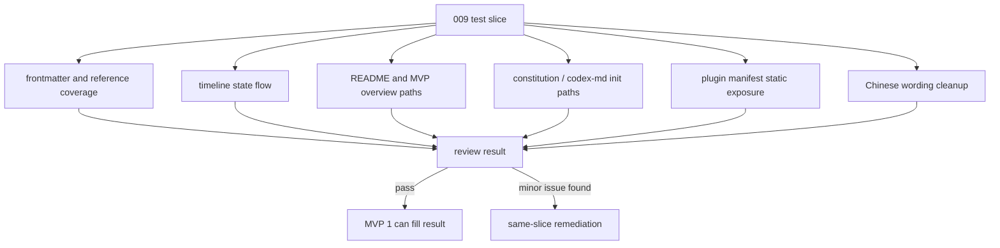

# 方案：验证 Solution Workflow 结构与样例流程

## Timeline Context

- MVP 总览：`.codex/timeline/mvp/workflow-architecture-refactor/MVP_OVERVIEW.md`
- Timeline：`.codex/timeline/refactor-feature-development/`
- Active slice：`009-test-workflow-structure-sample-validation`
- 最小闭环：`solution -> solution-task -> solution-execute -> solution-review`
- 当前分支：`feat/refactor-feature-development`
- 工作切片：`009`
- 切片类型：`test`

## Type Decision

- 讨论确认类型：`test`
- 用户输入："做下一个 feature 吧"
- 解释：按当前 MVP timeline 的下一个 candidate 推进；候选 009 的实际类型是 `test`，用于最终结构审查、样例流程验证和初始化路径审计。
- 分支类型：`feat`
- 选定类型：`test`
- 置信度：高
- 理由：本 slice 以验证当前 MVP 1 的 Markdown/JSON 配置、状态流、路径约定和样例流程为主；用户纠正后，发现的可控文档/配置不一致和 skills 表述统一问题可以在本 slice 内直接修正。
- 备选考虑：`feat` 不合适，因为不新增用户可感知能力；独立 `fix` slice 不采用，因为用户确认小修留在 009 内完成，避免流程过重。

## Branch Rename Checkpoint

- 当前分支：`feat/refactor-feature-development`
- 选定类型：`test`
- 建议分支：`test/workflow-structure-sample-validation`
- 是否需要重命名：否
- 理由：当前分支承载整个 workflow architecture refactor MVP，继续在同一分支记录本 MVP 后续 slice。
- 交付动作：无

## Goal

完成 MVP 1 Solution 最小闭环的最终验证与收口：审查 frontmatter、路径、链接、阶段边界、timeline 状态流、Visual Model 规则、样例流程、Codex 初始化类 skill 的 `.codex` 路径一致性，并统一 solution workflow 相关 skills 的中文表述。

## Problem

当前 solution workflow 已完成多个行为、文档和版本切片，但还缺少一个集中验证切片来回答：

- 新增 `solution*` skills 是否都有完整 frontmatter 和必要 reference。
- `current.json` / `states/*.json` / solution-task-execute-review 的状态流是否一致。
- README、MVP overview 和 timeline 记录是否仍描述同一套路径约定。
- `constitution` 与 `codex-md` 是否仍以 `.codex/constitution.md` 和根目录 `AGENTS.md` 为 Codex 初始化入口。
- 008 延后的插件安装可见性验证需要纳入本轮最终验证，并在执行前明确会触达的 Codex 本地路径。
- Solution workflow 相关 skills 中存在中英混杂表述，需要统一为中文用户可读风格，同时保留必要英文术语、命令、路径和状态名。

如果这些检查不集中执行，MVP 1 可能在交付前留下路径漂移、状态流漂移或初始化边界不清的问题。

## Context Read

- [x] `AGENTS.md`
- [x] `.codex/constitution.md`
- [x] `.codex/timeline/mvp/workflow-architecture-refactor/MVP_OVERVIEW.md`
- [x] `.codex/timeline/refactor-feature-development/current.json`
- [x] `.codex/timeline/refactor-feature-development/states/008-build-codex-plugin-version-update.json`
- [x] `.codex/timeline/refactor-feature-development/solutions/008-build-codex-plugin-version-update.md`
- [x] `.codex/timeline/refactor-feature-development/tasks/008-build-codex-plugin-version-update.md`
- [x] `.codex/timeline/refactor-feature-development/reviews/008-build-codex-plugin-version-update.md`
- [x] `plugins/porter-codex-plugin/skills/solution/SKILL.md`
- [x] `plugins/porter-codex-plugin/skills/solution/reference/test.md`
- [x] `plugins/porter-codex-plugin/skills/constitution/SKILL.md`
- [x] `plugins/porter-codex-plugin/skills/codex-md/SKILL.md`
- [x] `plugins/porter-codex-plugin/.codex-plugin/plugin.json`
- [x] `.agents/plugins/marketplace.json`

## Scope

### 做

- 验证 Codex solution workflow 相关 skill 的 frontmatter 字段、目录结构和命名。
- 验证 `solution/reference/*.md`、`solution-task/reference/*.md`、`solution-execute/reference/*.md` 中支持类型的覆盖情况。
- 验证 `solution -> solution-task -> solution-execute -> solution-review` 的阶段边界、状态转移和 allowed outputs 是否一致。
- 验证 `.codex/timeline/refactor-feature-development/current.json` 和 active slice state 指针是否符合新路径约定。
- 验证 README、MVP overview、active timeline 记录对 `.codex/timeline/<timeline-name>/` 的描述是否一致。
- 验证 Mermaid Visual Model 规则在 solution reference 与已有 solution 记录中可追踪。
- 审计 `constitution` 和 `codex-md` 是否使用 `.codex/constitution.md` 与根目录 `AGENTS.md`，不写入用户 home 目录。
- 统一 solution workflow 相关 skills 的中文表述，避免用户可见说明中中英混杂：
  - `plugins/porter-codex-plugin/skills/solution/`
  - `plugins/porter-codex-plugin/skills/solution-task/`
  - `plugins/porter-codex-plugin/skills/solution-execute/`
  - `plugins/porter-codex-plugin/skills/solution-review/`
- 保留必要英文：skill 名称、命令名、Git type、state 名、JSON/frontmatter key、文件路径、目录名、代码块、约定术语和平台名称。
- 将 008 延后的安装可见性验证纳入本 slice：先确认 plugin manifest 暴露 `skills` 目录、marketplace 指向本地 Codex plugin；如需要真实安装验证，在 task/execute 阶段明确记录会触达的 Codex 本地路径和验证方式。
- 如发现可控的文档/配置不一致，在本 slice 内直接修正；只有超出当前 MVP 或涉及行为重构的内容才在 review 中记录为后续问题，不默认拆独立 `fix` slice。

### 不做

- 不在 task/execute 阶段之外真实安装插件。
- 不在未记录触达路径和验证目的的情况下写入用户本机 `~/.codex`。
- 不写入用户本机 `~/.claude`、`~/.agents` 或 `~/plugins`。
- 不修改 `plugins/porter-claude-plugin/`。
- 不删除旧 `plan-*` / `analyze-bug` 入口。
- 不新增 runtime 依赖、测试框架、构建工具或自动化脚本。
- 不实现 `delivery-*` Git 生命周期。
- 不修改 workflow 行为；这里的 workflow 行为指 `solution*` skills 的执行规则、状态转移、allowed outputs 或用户交互边界。
- 不翻译或重命名路径、命令、skill 名、Git type、state 名、frontmatter key 或 JSON key。

## Type-Specific Analysis

### 测试目标

验证 MVP 1 Solution 最小闭环的文档配置结构和样例流程，覆盖 Codex solution workflow skills、timeline records、MVP overview、README 推荐路径和初始化类 `.codex` 路径约定。

### 覆盖缺口

当前缺少集中检查：

- frontmatter 必填字段和 Markdown 结构。
- reference type 覆盖是否与 `solution` 支持类型一致。
- `current.json` 和 `states/*.json` 的 active slice 指针、state、next skill、allowed outputs 是否互相匹配。
- `solution-execute` 首次执行与 review 回修执行的状态边界是否能从文档中闭环。
- Mermaid Visual Model 规则是否在 reference 和已有 solution 中有一致表述。
- `constitution`、`codex-md` 是否仍符合 `.codex/constitution.md` 与根目录 `AGENTS.md` 的初始化约定。
- 插件安装可见性验证是否被纳入本 slice，并且真实安装前是否明确触达路径、验证目的和回滚边界。
- Solution workflow 相关 skills 的用户可见说明是否统一为中文表述，避免不必要的中英混杂。

### 测试类型

手动结构验证，辅以轻量命令检查：

- `jq` 校验 JSON。
- `rg --files` / `rg` 校验路径、引用、命名和关键状态。
- `git diff --check` 校验空白错误。
- 人工审查 Markdown frontmatter、阶段边界和样例流程。

不引入测试框架。

### 用例设计

Given 当前分支包含 001-008 已完成的 solution workflow 切片，When 执行 009 结构验证，Then 应能确认所有新增 Codex solution workflow 配置路径、frontmatter、reference、状态流和初始化路径约定一致。

Given `solution` 支持 `feat/fix/refactor/perf/test/docs/build/ci/chore/style`，When 检查 reference 目录，Then 对应 reference 文件应存在且能被相关 workflow 阶段说明引用。

Given 当前 active slice 从 008 切换到 009，When 检查 `current.json` 和 009 state，Then active slice、solution/task/review/state 指针和 allowed outputs 应匹配。

Given 008 已将真实安装验证延后，When 执行 009，Then 应先做 manifest/marketplace 的静态暴露检查，再按任务中记录的触达路径做 Codex 插件安装/可见性验证。

Given `constitution` 和 `codex-md` 是 Codex 初始化类 skill，When 审计路径约定，Then 它们应只描述 `.codex/constitution.md` 和根目录 `AGENTS.md`，不要求写入用户 home 配置。

Given solution workflow 相关 skills 需要统一中文表述，When 审查 `solution`、`solution-task`、`solution-execute` 和 `solution-review` 相关 skill 文档，Then 用户可见说明应尽量使用中文，且命令、路径、type、state、frontmatter/JSON key 等必要英文保持不变。

### Mock 策略

无。所有验证基于仓库内 Markdown/JSON 文件和 git diff，不依赖外部服务。

### 业务行为变更

不改业务行为。本 slice 可以修正文档/配置表述和局部一致性问题，但不改变 `solution*` skills 的执行规则、状态转移、allowed outputs 或用户交互边界。

## Visual Model

## Proposed Changes

- 新增当前 009 solution 记录。
- 后续 task 阶段生成结构验证任务清单。
- 后续 execute 阶段执行结构审查、命令验证、solution workflow 相关 skills 中文表述统一和已确认的 Codex 插件安装/可见性验证，并更新 task 验证记录。
- 后续 review 阶段记录 pass、仍需本 slice 回修的问题，或超出当前 MVP 的后续问题。

本 solution 阶段不修改被验证对象。

## Acceptance

- 009 task 能覆盖 frontmatter、路径、链接、阶段边界、timeline 状态流、Visual Model 规则和 sample flow。
- `plugins/porter-codex-plugin/skills/solution*` 的支持类型 reference 覆盖与 `solution` 支持类型一致，或记录明确缺口。
- `current.json` 和 009 state 指针符合 `.codex/timeline/<timeline-name>/` 新路径约定。
- `constitution` 和 `codex-md` 与 `.codex/constitution.md` / 根目录 `AGENTS.md` 路径约定一致；如发现可控不一致，优先在本 slice 内回修。
- `plugin.json` 与 `.agents/plugins/marketplace.json` 能证明 Codex plugin 静态暴露 `skills` 目录。
- Codex 插件真实安装/可见性验证在本 slice 执行，并记录触达路径、验证结果和任何限制。
- Solution workflow 相关 skills 的用户可见说明统一为中文表述，必要英文术语、命令、路径、type、state 和 key 保持原样。
- 不修改 `plugins/porter-claude-plugin/`。
- 除已确认的 Codex 插件安装/可见性验证路径外，不写入用户 home 配置目录。
- 不引入运行时依赖、测试框架或构建工具。
- 如发现文档/配置不一致，优先在本 slice 内完成小修；如涉及超出当前 MVP 的行为重构，review 记录具体 finding 和后续建议。

## Risks

- 真实 Codex 插件安装/可见性验证可能触达用户本机 Codex 配置目录；执行阶段必须先列明路径、目的和验证方式。
- 统一中文表述时可能误改应保留的英文约定；执行阶段需要明确保留命令、路径、type、state、key 等固定标识。
- MVP overview 当前仍把 007 标为 active、008 标为 candidate；这可能是验证中需要记录的 timeline overview 状态漂移，不在 solution 阶段提前修复。

## Confirmation Needed

- [x] 将"下一个 feature"按当前 MVP 的下一个 slice 处理。
- [x] 当前下一个 slice 的实际类型是 `test`，不是 `feat`。
- [x] 本 slice 只做结构验证、样例流程验证和初始化路径审计。
- [x] 用户确认真实安装/可见性验证需要纳入 009。
- [x] 如安装验证需要触达用户本机 `~/.codex`，必须在 task/execute 阶段明确路径、目的和验证方式。
- [x] 用户纠正：发现可控不一致时不默认拆独立 `fix` slice，优先在 009 内完成小修。
- [x] 用户新增并修正范围：solution workflow 相关 skills 的用户可见说明需要统一中文表述，避免不必要的中英混杂；不清理非 solution 相关 skills。
- [x] 不修改 `plugins/porter-claude-plugin/`。

## Next Step

请先确认 `Confirmation Needed`。如果无需调整，请显式调用 `$porter-codex-plugin:solution-task` 生成任务清单。
