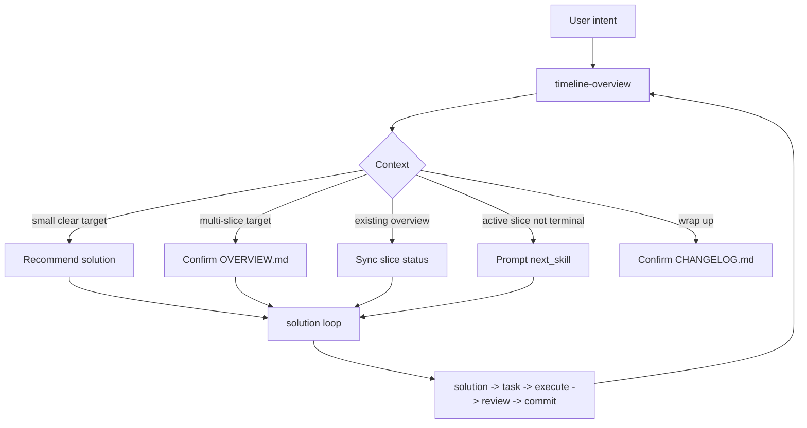

# Solution: timeline-overview workflow

## 时间线上下文

- Timeline：`.codex/timeline/timeline-overview-workflow/`
- Active slice：`001-feat-timeline-overview-workflow`
- Solution：`.codex/timeline/timeline-overview-workflow/solutions/001-feat-timeline-overview-workflow.md`
- State：`.codex/timeline/timeline-overview-workflow/states/001-feat-timeline-overview-workflow.json`
- Current pointer：`.codex/timeline/timeline-overview-workflow/current.json`

本 slice 用于定义并落地 Codex 插件侧的 `timeline-overview` workflow 能力。它不是 MVP 管理系统，也不是新的 slice type；它是 timeline 级别的范围判断、总览维护和收口辅助。

## 类型决策

- Type：`feat`
- 理由：新增 `$porter-codex-plugin:timeline-overview` skill，属于新的用户可感知 workflow 能力。
- 备选 type：`docs`
- 不选 `docs` 的理由：本次不只是补说明，还要新增一个可调用的 Codex skill，并让推荐路径与现有 solution workflow 形成联动。
- 不新增 type：`mvp`
- 理由：`mvp` 或 overview 是 timeline container 概念，不是 Conventional Commit / solution slice type。

## 工作上下文

- 当前分支：`codex/mvp-branch`
- 工作目录：`/Users/porterzhang/AiCode/porter-plugins`
- 默认修改范围：`plugins/porter-codex-plugin/`、`README.md` 和当前 `.codex/timeline/timeline-overview-workflow/`
- 不修改：`plugins/porter-claude-plugin/`、用户本机 `~/.codex`、`~/.claude`、`~/.agents` 或 `~/plugins`

## 目标

新增一个轻量的 `$porter-codex-plugin:timeline-overview` skill，用来在用户不确定目标范围、连续做多个 solution slice、或准备收口总结时，自动判断当前应该进行范围评估、进展同步还是 timeline 收尾。

该 skill 的默认职责是看全局：

- 判断一个目标是否适合单个 solution slice。
- 当目标明显需要多个 slice 时，先回放拆分建议，用户确认后维护 timeline 级 `OVERVIEW.md`。
- 当已有 overview 和 solution slices 时，同步 slice 进展并推荐下一步。
- 当用户要求收尾时，生成或更新 timeline 级 `CHANGELOG.md` / result 总结。

现有 `solution -> solution-task -> solution-execute -> solution-review` 继续作为单个 slice 的执行闭环。

## 问题

当前 solution workflow 已能处理单个切片，但用户真实工作里常出现三种情况：

1. 一开始不确定目标是不是单个 slice。
2. 先用 solution 分析后，发现目标包含多个 feat/docs/build/test 等切片。
3. 连续做完多个 solution 后，需要知道整体做到哪、为什么这些 slice 属于同一条 timeline、是否可以收口。

如果为这些情况强制引入 MVP 流程，会让普通工作流变重；如果完全不做 overview，则多个 solution slice 之间的关系、完成标准和最终总结容易散掉。

因此需要一个可选的 timeline 级 skill：默认不介入单 slice 状态机，只在范围需要整理、同步或收口时出现。

## 已读上下文

- `AGENTS.md`
- `.codex/constitution.md`
- `README.md`
- `plugins/porter-codex-plugin/skills/solution/SKILL.md`
- `plugins/porter-codex-plugin/skills/solution-task/SKILL.md`
- `plugins/porter-codex-plugin/skills/solution-execute/SKILL.md`
- `plugins/porter-codex-plugin/skills/solution-review/SKILL.md`
- `plugins/porter-codex-plugin/skills/skill-recommender/SKILL.md`
- `plugins/porter-codex-plugin/skills/solution/reference/feat.md`
- `.codex/timeline/mvp/workflow-architecture-refactor/MVP_OVERVIEW.md`
- `.codex/timeline/mvp/workflow-architecture-refactor/STAGE_OVERVIEW.md`

## 范围

### 做什么

- 新增 Codex skill：`plugins/porter-codex-plugin/skills/timeline-overview/SKILL.md`。
- 定义 `timeline-overview` 的自动模式判断规则，而不是要求用户显式选择 `assess` / `sync` / `close`。
- 定义 timeline 级输出：
  - `.codex/timeline/<timeline-name>/OVERVIEW.md`
  - `.codex/timeline/<timeline-name>/CHANGELOG.md`
- 定义 `timeline-overview` 的语言约定：说明和模板默认中文，保留 workflow 稳定标识、路径、state、type 等英文术语。
- 更新 Codex 插件 manifest 版本为 `2.1.0`，用于标记本次新增 timeline overview workflow 能力。
- 定义 `timeline-overview` 与现有 solution workflow 的联动边界。
- 更新 `solution` 前置讨论规则：当目标明显不是单个 slice 时，明确建议停止当前 solution 写入并调用 `$porter-codex-plugin:timeline-overview`。
- 更新 `skill-recommender`，在用户表达范围判断、多个 slice、timeline 总览或收尾总结时推荐 `timeline-overview`。
- 更新 `README.md` 的推荐路径，说明默认继续使用 solution；只有需要整理一串 slice 时才使用 timeline overview。
- 结构审查新增 skill frontmatter、路径、命名和文档约束。

### 不做什么

- 不新增 `mvp` slice type。
- 不新增 `mvp-overview` skill。
- 不复活或依赖遗留 `stage-overview` 体系。
- 不改变 `states/<slice>.json` 的核心 solution 状态机。
- 不让 `timeline-overview` 变成 `solution -> solution-task` 之间的强制 gate。
- 不提交、不合并、不 push、不 create PR。
- 不修改 Claude Code 插件侧配置。

## 类型专项分析

### 功能目标

提供 `$porter-codex-plugin:timeline-overview`，用于判断和维护 timeline 级范围、slice 列表、进展和收口总结。

### 用户价值

用户在目标可能变大、连续做多个 solution slice、或需要总结一条 timeline 时，不必自己判断该调用 `assess`、`sync` 还是 `close`，只要表达自然意图，skill 自动路由并在写入前回放确认。

### 功能边界

`timeline-overview` 负责 overview 级账本，不负责执行单个 slice：

- 可以读取 active solution state、current pointer、solution/task/review 文件和现有 overview/changelog。
- 可以创建或更新 timeline 级 `OVERVIEW.md` 和 `CHANGELOG.md`。
- 可以推荐下一步调用 `$porter-codex-plugin:solution` 或当前 active state 的 `next_skill`。
- 不创建 solution slice id。
- 不生成 task 文件。
- 不执行实现。
- 不执行 review。
- 不直接 commit。

`solution` 负责单 slice 前置判断。当 solution discussion 发现目标已经明显包含多个可独立验收的 slice 时，不继续写半成品 solution 文件，而是提示用户显式调用 `$porter-codex-plugin:timeline-overview` 先整理 timeline。

### 方案设计

用户只调用一个入口：

```text
$porter-codex-plugin:timeline-overview <自然语言意图>
```

skill 根据上下文自动判断内部模式：

| 上下文 | 自动模式 | 行为 |
| --- | --- | --- |
| 没有 overview，用户提出新目标且范围不确定 | assess | 判断单 slice / 多 slice；单 slice 推荐 `solution`；多 slice 回放拆分建议，确认后写 `OVERVIEW.md` |
| 已有 overview，用户问进展或做完一个 slice | sync | 读取 `current.json` 和 `states/*.json`，同步 overview 中 slice 状态并推荐下一步 |
| 已有 overview，active slice 未终止 | gate | 不推进 overview，提示继续 state 中的 `next_skill` |
| 用户说收尾、总结、差不多了 | close | 检查候选是否完成或明确 deferred，确认后写 `CHANGELOG.md` / result |
| 多个 timeline 候选或无法判断 timeline name | clarify | 停止并请用户确认 timeline name |

overview 层状态只存在于 Markdown 表格中，例如：

```text
candidate | active | committed | deferred | cancelled
```

这些状态不是机器 gate。真实执行 gate 继续以 `states/<slice>.json` 为准。

### 目录结构

预期新增或修改：

```text
plugins/porter-codex-plugin/skills/timeline-overview/SKILL.md
plugins/porter-codex-plugin/.codex-plugin/plugin.json
plugins/porter-codex-plugin/skills/solution/SKILL.md
plugins/porter-codex-plugin/skills/skill-recommender/SKILL.md
README.md
.codex/timeline/timeline-overview-workflow/current.json
.codex/timeline/timeline-overview-workflow/solutions/001-feat-timeline-overview-workflow.md
.codex/timeline/timeline-overview-workflow/tasks/001-feat-timeline-overview-workflow.md
.codex/timeline/timeline-overview-workflow/reviews/001-feat-timeline-overview-workflow.md
.codex/timeline/timeline-overview-workflow/states/001-feat-timeline-overview-workflow.json
```

任务、审查和实现过程文件由后续 `solution-task`、`solution-execute`、`solution-review` 生成。

### 接口或配置

新增 skill 入口：

```text
$porter-codex-plugin:timeline-overview <自然语言意图>
```

用户不需要传模式参数。文档中可以描述内部模式，但不要求用户精确调用：

- assess
- sync
- close
- gate
- clarify

### 数据流

```text
User intent
  -> timeline-overview
  -> read AGENTS / constitution / README when needed
  -> resolve timeline name
  -> read OVERVIEW.md / CHANGELOG.md if present
  -> read current.json and states/*.json when present
  -> decide internal mode
  -> either recommend solution / next_skill, or ask confirmation before writing overview/changelog
```

### 实现顺序

1. 新增 `timeline-overview` skill 文档，定义职责、入口、自动模式判断、输出和状态边界。
2. 更新 `skill-recommender` 推荐规则。
3. 更新 `README.md` 推荐路径说明。
4. 做 Markdown/frontmatter/path 结构审查。
5. 通过 review 确认没有引入 `mvp` type、没有修改 Claude 侧、没有把 timeline overview 写成强制 gate。

## 视觉模型



## 拟议变更

- 新增 `plugins/porter-codex-plugin/skills/timeline-overview/SKILL.md`：
  - 说明它是 timeline 级范围判断和总览维护 skill。
  - 明确只维护 `OVERVIEW.md` / `CHANGELOG.md`，不创建 solution slice。
  - 写明自动模式判断规则。
  - 写明写入前必须回放并确认。
  - 写明 active slice 未终止时不推进 overview 收口。
  - 写明语言约定，并把 `OVERVIEW.md` / `CHANGELOG.md` 模板标题、说明和表头默认设为中文。
- 更新 `plugins/porter-codex-plugin/.codex-plugin/plugin.json`：
  - 将 manifest `version` 更新为 `2.1.0`。
- 更新 `plugins/porter-codex-plugin/skills/solution/SKILL.md`：
  - 当 pre-solution discussion 发现目标明显包含多个 slice 时，明确推荐 `$porter-codex-plugin:timeline-overview`。
  - 明确如果尚未正式写入 solution 文件，应停止写入并先进入 timeline overview discussion。
  - 保持 `solution` 不创建 overview、不拆完整 timeline、不改变 state 机。
- 更新 `plugins/porter-codex-plugin/skills/skill-recommender/SKILL.md`：
  - 用户不确定是否多 slice时推荐 `timeline-overview`。
  - 用户要同步一串 solution 进展或收尾时推荐 `timeline-overview`。
  - 用户目标已明确是一个小切片时仍推荐 `solution`。
- 更新 `README.md`：
  - 把 `timeline-overview` 加入 Codex skills 表。
  - 说明默认 solution 主路径。
  - 说明 overview 是可选范围整理工具。
  - 说明 timeline 级状态不替代 `states/<slice>.json` gate。
- 保持现有 `solution` 四件套状态机不变。

## 验收标准

- 新增 `timeline-overview` skill frontmatter 完整，路径使用 kebab-case。
- `solution` 前置讨论能在目标明显超过单 slice 时明确路由到 `$porter-codex-plugin:timeline-overview`，且不写半成品 solution。
- skill 文档明确用户不需要手动选择 `assess` / `sync` / `close`。
- skill 文档明确 timeline overview 也有讨论、回放和确认规则，未确认前不写 `OVERVIEW.md` 或 `CHANGELOG.md`。
- skill 文档明确 `timeline-overview` 不创建 slice id、不生成 task、不执行、不 review、不 commit。
- skill 文档明确 overview 层状态不替代 `states/<slice>.json` workflow gate。
- skill 文档明确默认输出中文，且 `OVERVIEW.md` / `CHANGELOG.md` 模板标题、正文和表头以中文为主；只保留路径、state、type、skill 名等稳定标识为英文。
- Codex 插件 manifest `version` 为 `2.1.0`。
- `skill-recommender` 能区分：
  - 小目标：推荐 `solution`。
  - 范围不确定、多个 slice、进展同步、收尾：推荐 `timeline-overview`。
- `README.md` 能解释 timeline overview 与 solution workflow 的关系。
- 全局不新增 `mvp` slice type。
- 变更范围不触碰 Claude Code 插件侧或用户 home 配置。

## 风险

- 如果 `timeline-overview` 规则写得过重，会让普通 solution workflow 变成必须先规划 overview，违背简单性原则。
- 如果 overview 状态与 slice state 混用，可能造成用户误以为 Markdown 表格状态可以替代 workflow gate。
- 如果 `sync` 自动改动太多，可能引入隐式决策；因此写入前必须回放并等待确认，或只做最小状态同步。
- 如果 README 表述不清，用户可能误以为 `MVP_OVERVIEW.md` 或 `stage-overview` 是新主路径。

## 待确认

- 请确认 type 选择为 `feat`。
- 请确认 timeline name 为 `timeline-overview-workflow`。
- 请确认本 slice 的目标是新增 `timeline-overview` skill，而不是 `mvp-overview`。
- 请确认本 slice 不新增 `mvp` slice type。
- 请确认本 slice 不修改现有 solution 核心状态机。
- 请确认 overview 层状态只作为人类可读账本，不作为 workflow gate。
- 请确认输出路径和 slice 命名为 `001-feat-timeline-overview-workflow`。
- 请确认工作上下文为当前分支 `codex/mvp-branch`。
- 请确认接受 `solution-task` 前置 hook 后续可能将本地分支名对齐为 `feat/timeline-overview-workflow`。
- 请确认是否可以进入 `$porter-codex-plugin:solution-task`。

## 下一步

确认本 solution 后，显式调用：

```text
$porter-codex-plugin:solution-task
```

生成 active slice 的任务清单。
