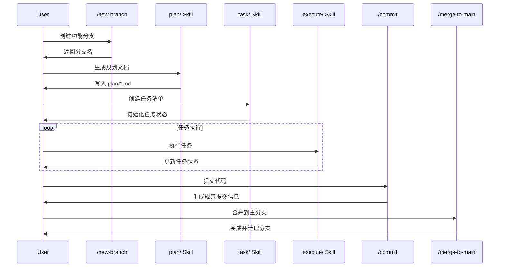
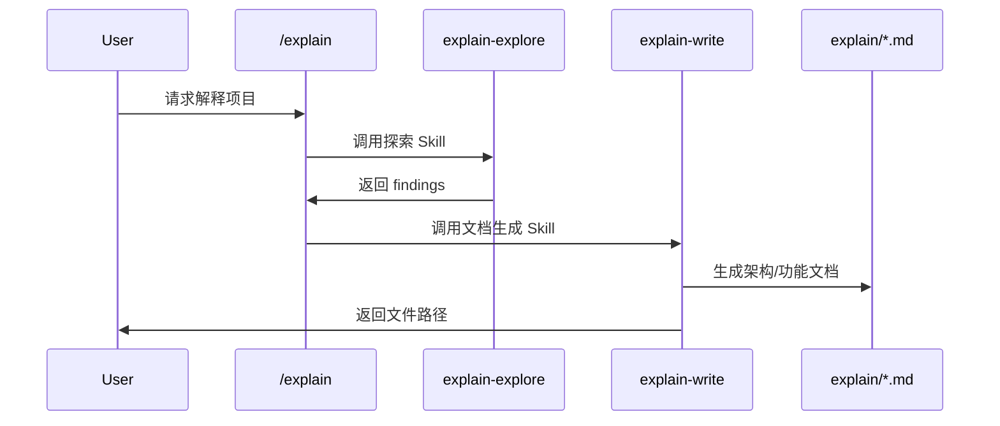

# Architecture: claude-plugins

> 生成时间：2026-03-23

## 项目简介

这是一个 Claude Code 的插件配置项目，提供自定义斜杠命令、工作流 Skill 和 MCP 配置模板。目标是让 Claude Code 的行为更规范、可复用，适用于需要团队协作或个人标准化工作流的场景。

## 目录结构

```
/Users/poterzhang/AIProjects/claude-plugins/
├── .claude/
│   ├── constitution.md    # 项目开发宪法（核心原则）
│   └── settings.json      # Claude Code 权限配置
├── commands/              # 7 个自定义斜杠命令
│   ├── commit.md          # 提交命令（Conventional Commits）
│   ├── new-branch.md      # 分支创建命令
│   ├── constitution.md    # 宪法生成命令
│   ├── explain.md         # 项目解释命令
│   ├── claude-md.md       # CLAUDE.md 生成命令
│   ├── merge-to-main.md   # 分支合并命令
│   └── setup-permissions.md # 权限配置命令
├── skills/                # 5 个工作流 Skill
│   ├── plan/              # 规划生成 Skill
│   ├── task/              # 任务清单 Skill
│   ├── execute/           # 任务执行 Skill
│   ├── explain-explore/   # 项目探索 Skill
│   └── explain-write/     # 文档生成 Skill
├── mcp/
│   └── mcp-config.template.json  # MCP 服务配置模板
├── plan/                  # 规划文档目录
│   └── docs/              # 文档类规划
├── README.md              # 项目说明
└── CLAUDE.md              # 项目操作手册
```

## 系统架构图

```mermaid
graph TD
    User[用户] --> Commands[commands/ 斜杠命令]
    User --> Skills[skills/ 工作流 Skill]

    Commands --> |初始化| Init[链路1: 项目初始化]
    Commands --> |开发| Dev[链路2: 功能开发]
    Commands --> |解释| Explain[链路3: 项目解释]

    Init --> Constitution[/constitution]
    Init --> ClaudeMd[/claude-md]
    Init --> SetupPermissions[/setup-permissions]

    Dev --> NewBranch[/new-branch]
    Dev --> Plan[plan/ Skill]
    Dev --> Task[task/ Skill]
    Dev --> Execute[execute/ Skill]
    Dev --> Commit[/commit]
    Dev --> MergeToMain[/merge-to-main]

    Explain --> ExplainCmd[/explain]
    Explain --> Explore[explain-explore/ Skill]
    Explain --> Write[explain-write/ Skill]
    Write --> Docs[生成 explain/*.md 文档]

    Skills --> |依赖| MCP[mcp/ 配置模板]
    Skills --> |依赖| ClaudeConfig[.claude/ 配置]
```

## 核心数据流

### 功能开发工作流



### 项目解释工作流



## 技术选型

| 组件 | 选型 | 理由 |
|------|------|------|
| 配置格式 | Markdown + JSON | 纯文本，版本控制友好，无需运行时解析 |
| 命令系统 | Claude Code 斜杠命令 | 原生集成，无需额外 CLI 工具 |
| Skill 系统 | Claude Code Skills | 可复用的工作流封装，支持参数传递 |
| 命名规范 | kebab-case | 与 Claude Code 内置命令风格一致 |

## 模块依赖关系

```
commands/          <-- 完全独立，可直接复制使用
skills/
  ├── plan/        <-- 独立
  ├── task/        <-- 独立
  ├── execute/     <-- 依赖 task/（读取任务状态）
  ├── explain-explore/  <-- 独立
  └── explain-write/    <-- 依赖 explain-explore/（接收 findings）

mcp/               <-- 模板文件，独立
.claude/           <-- 项目级配置，被所有模块引用
```

**可独立替换的模块：**
- 任意 `commands/*.md` 可单独增删
- `skills/plan/`、`skills/task/`、`skills/execute/` 可替换为其他工作流
- `mcp/` 配置可根据项目需求定制

## 关键约定

1. **配置即代码** - 所有功能通过 Markdown/JSON 配置实现，不引入运行时依赖
2. **路径即语义** - 目录结构反映功能分类，如 `commands/commit.md` 对应 `/commit` 命令
3. **原子提交** - 每个功能变更对应独立的 plan 文档和任务清单
4. **模板继承** - Skill 通过 `templates/*.md` 确保输出格式一致性
5. **无状态设计** - Skill 之间通过参数传递数据，不依赖外部状态存储

## 功能清单

| 功能 | 简述 | 深入探索 |
|------|------|---------|
| 项目初始化 | 生成 constitution.md、CLAUDE.md 和权限配置 | `/explain feature initialization` |
| 分支管理 | 规范化的分支创建和合并流程 | `/explain feature branch-management` |
| 任务工作流 | plan → task → execute 的完整开发流程 | `/explain feature task-workflow` |
| 项目解释 | 自动生成架构文档和功能说明 | `/explain feature documentation` |
| 提交规范 | Conventional Commits 格式的自动提交 | `/explain feature commit` |

> 从这里选一个感兴趣的功能，运行对应命令即可深入了解。
