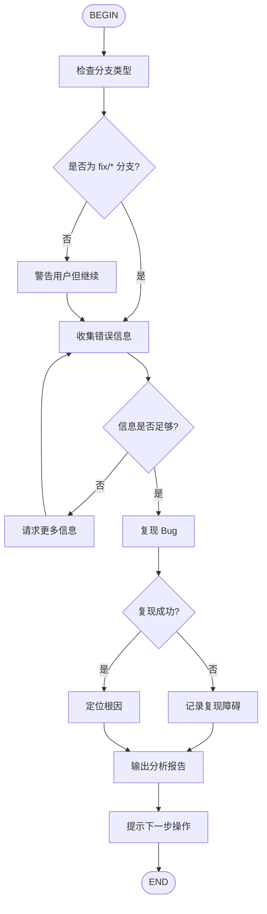

# Bug Analysis Workshop

Bug 分析的标准流程：复现问题 → 定位根因 → 输出分析报告



## 节点说明

### 检查分支类型
验证当前是否在 `fix/*` 分支上：
- 如果是 `main`/`master`：建议先运行 `/new-branch fix/<bug-name>`
- 如果不是 `fix/*`：警告用户但继续执行

### 收集错误信息
询问用户提供（可多选）：
- [ ] 错误日志或堆栈跟踪
- [ ] 复现步骤
- [ ] 预期行为 vs 实际行为
- [ ] 相关代码位置（如果已知）

### 复现 Bug
- 根据复现步骤执行，确认问题
- 如果是测试失败，运行测试收集错误信息
- 记录关键现象和错误输出

### 定位根因
使用 `Agent(subagent_type="explore")` 深入分析：
1. 从错误堆栈追踪调用链
2. 识别数据流中的问题环节
3. 对比预期 vs 实际代码逻辑
4. 标记根因位置和原因

### 输出分析报告
生成 `plan/fix/<branch-name>/ANALYSIS.md`：

```markdown
# Bug 分析报告

## 问题描述
<!-- 一句话概括 -->

## 复现步骤
1. 
2. 
3. 

## 预期 vs 实际
- 预期：
- 实际：

## 根因分析

### 触发条件

### 问题位置
- 文件：
- 函数/行号：

### 原因详解

## 影响范围

## 建议修复方案
```

### 提示下一步操作
分析报告完成后，提示用户：

```
✅ Bug 分析完成！

下一步：
  1. 运行 /task 生成修复任务清单（推荐，确保 TDD）
  2. 直接运行 /execute 开始修复（改动简单时）

TDD 提醒：fix 类型必须遵循：
  1. 先写复现测试（红）
  2. 再写修复代码（绿）
  3. 运行全量测试确认无回归
```

## 禁止事项

- ❌ 分析阶段不要直接修改代码修复 bug
- ❌ 不要跳过复现直接看代码
- ❌ 分析报告中不要包含具体修复代码
