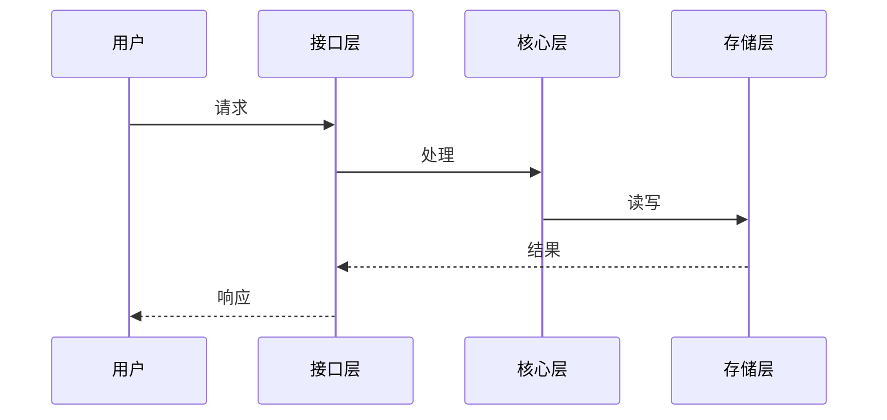

# Feature: {topic}

> 生成时间：{date}

## 功能概览

一句话：这个功能做什么，谁来触发，返回什么。

## 实现路径

## 关键步骤说明

对上图中不显而易见的步骤补充说明（显而易见的跳过）。

1. **{步骤名}** — 为什么这样做，有什么约束
2. **{步骤名}** — ...

## 数据形态变化

输入 → 中间态 → 输出，重点说明数据在哪一步发生了本质变化。

## 错误路径

哪些步骤可能失败，失败后怎么处理，调用方会收到什么。
