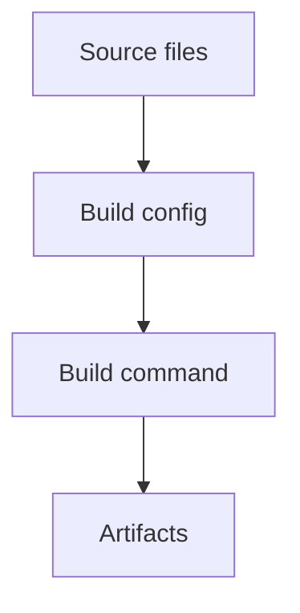

# build — Solution 模板

## 类型专项分析必填字段

1. **变更内容** — 修改哪个构建工具、脚本或配置。
2. **变更原因** — 解决什么构建问题或优化目标。
3. **影响范围** — 哪些命令、产物、环境或目录会受影响。
4. **兼容性说明** — 是否影响现有使用方式。
5. **验证方式** — 如何确认构建正常。

## 视觉模型

`build` 建议使用 Mermaid `flowchart` 表达构建输入、步骤和产物。

如果只是单个配置值调整，可以写明"无图，原因：..."。

示例：

## 验收标准写法

- 构建命令成功。
- 产物或配置符合预期。
- 现有使用方式未被意外破坏。

## 待确认建议

- 构建变更范围是否正确。
- 兼容性要求是否完整。
- 验证命令是否可接受。
- 是否需要保留回滚方案。

## solution-task 提示

- 通常无业务逻辑，无需业务测试。
- 必须包含构建验证任务。
