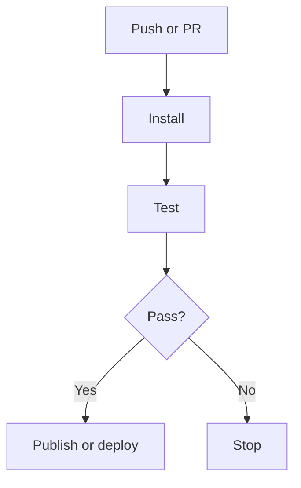

# ci — Solution 模板

## Type-Specific Analysis 必填字段

1. **变更内容** — 修改哪个 pipeline、workflow 或部署脚本。
2. **变更原因** — 解决什么 CI 问题或新增什么自动化能力。
3. **触发条件** — 哪些事件触发流程。
4. **影响范围** — 哪些分支、环境、任务或权限受影响。
5. **验证方式** — 如何在不破坏现有流水线的前提下验证。

## Visual Model

`ci` 建议使用 Mermaid `flowchart` 表达 pipeline 触发、job 顺序、失败分支和发布边界。

涉及多个外部系统或部署阶段时，可补充 `sequenceDiagram`。

示例：

## Acceptance 写法

- CI 配置语义明确。
- 触发条件符合预期。
- 验证方式不会破坏现有流水线。

## Confirmation Needed 建议

- 触发条件是否正确。
- 影响的分支或环境是否完整。
- 验证方式是否安全。
- 是否涉及权限或密钥风险。

## solution-task 提示

- 通常无业务逻辑，无需业务测试。
- 必须包含本地或远端 CI 验证方案。
