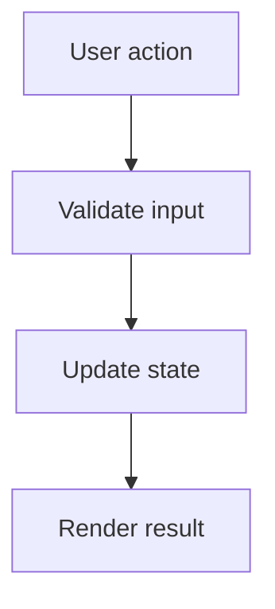

# feat — Solution 模板

## Type-Specific Analysis 必填字段

1. **功能目标** — 一句话描述这个功能解决什么问题。
2. **用户价值** — 谁会使用，完成后获得什么能力。
3. **功能边界** — 做什么 / 不做什么。
4. **方案设计** — 核心设计、模块关系、关键流程。
5. **目录结构** — 新增或修改的文件清单。
6. **接口或配置** — API、命令、配置项或对外入口；没有则写"无"。
7. **数据流** — 核心流程的数据流向；无数据流则写"无"。
8. **实现顺序** — 基于依赖关系排列模块顺序。

## Visual Model

`feat` 默认需要 Mermaid 图，帮助用户确认核心逻辑。

- 优先使用 `flowchart` 表达功能流程、状态流转或数据流。
- 当涉及多个角色、服务、API 调用或异步顺序时，使用 `sequenceDiagram`。
- 如果功能很小且没有流程或调用关系，写明"无图，原因：..."。

示例：

## Acceptance 写法

- 功能目标可被明确验证。
- 功能边界内的行为完成。
- 功能边界外的行为没有被引入。
- 需要测试的业务逻辑有测试策略。

## Confirmation Needed 建议

- 功能边界是否符合预期。
- 不做事项是否需要调整。
- 方案设计是否接受。
- 验收标准是否足够明确。

## solution-task 提示

- 有业务逻辑的模块必须测试先行。
- 无业务逻辑的配置或文档项标明无需测试，使用结构审查验证。
