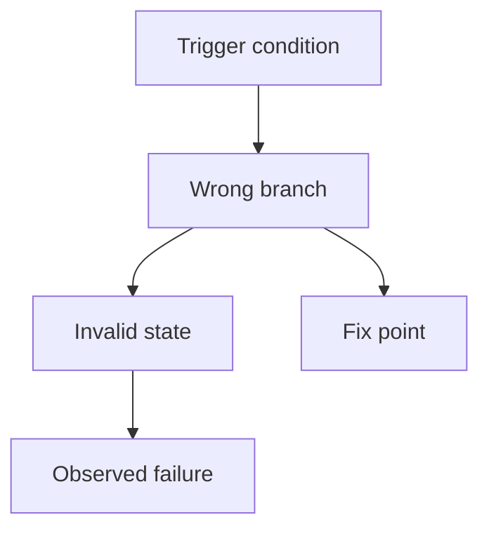

# fix — Solution 分析型模板

`fix` 是分析型 reference，不是普通规划型 reference。

## 分析流程

1. **收集现象** — 收集用户描述、错误日志、堆栈跟踪、失败命令、截图摘要或相关文件。
2. **复现问题** — 尝试用最小步骤复现；如果无法复现，记录复现障碍。
3. **定位根因** — 追踪触发条件、数据流、控制流、配置路径或状态变化。
4. **提出修复方案** — 说明拟修改哪些文件、为什么能解决问题。
5. **定义回归标准** — 至少包含一个能覆盖原问题的回归验证。
6. **写入 SOLUTION.md** — 将分析结果整理进`类型专项分析`。

## 信息不足时必须暂停

向用户索取：

- 错误日志或堆栈跟踪。
- 复现步骤。
- 预期行为 vs 实际行为。
- 相关代码位置，如果用户已知。

## 可自行复现时必须记录

- 复现命令。
- 关键输出。
- 复现结果。

## 类型专项分析必填字段

1. **Bug 描述** — 现象、触发条件、影响范围。
2. **复现步骤** — 最小复现路径、输入数据或操作序列。
3. **预期 vs 实际** — 正确行为与当前错误行为。
4. **根因分析** — 触发条件、问题位置、原因详解。
5. **修复方案** — 拟修改的文件和逻辑，说明为什么能解决问题。
6. **回归标准** — 至少一个能覆盖原问题的验证方式。
7. **影响范围** — 本次修复可能影响哪些功能或配置。

## 视觉模型

`fix` 通常需要 Mermaid 图来解释问题路径或根因链路。

- 优先使用 `flowchart` 表达触发条件、错误路径、根因和修复点。
- 当 bug 来自多组件调用顺序、请求链路或异步时，使用 `sequenceDiagram`。
- 如果问题非常局部，可以写明"无图，原因：..."。

示例：

## 验收标准写法

- 问题已被复现，或复现障碍已明确记录。
- 根因定位到具体文件、流程或配置。
- 修复方案能解释为什么解决原问题。
- 回归标准能防止同类问题再次出现。

## 待确认建议

- 复现步骤是否准确。
- 根因判断是否接受。
- 修复方案是否符合最小改动原则。
- 回归标准是否足够覆盖原问题。

## solution-task 提示

- 第一个任务必须是复现或回归验证任务。
- 修复任务必须在复现或验证任务之后。
- 新 solution workflow 中不额外调用 `$porter-codex-plugin:analyze-bug`。
