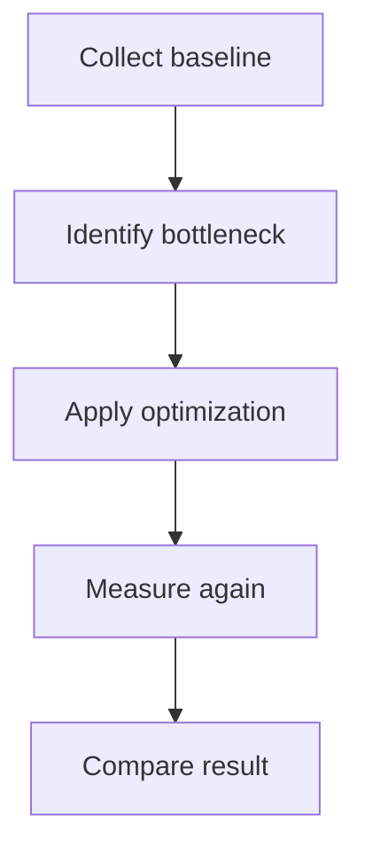

# perf — Solution 度量型模板

`perf` 是度量型 reference，不是普通规划型 reference。

## 度量流程

1. **明确性能目标或瓶颈线索** — 用户指出哪里慢、哪个流程资源消耗高，或期望达到什么阈值。
2. **建立度量方式** — 确定 benchmark、profiling、日志、计时、样本规模或手动观测方式。
3. **记录基线** — 如果环境允许，先运行并记录优化前数据；如果不能运行，写明基线采集计划。
4. **分析瓶颈** — 基于数据或代码路径提出瓶颈假设。
5. **提出优化方案** — 说明拟采取的优化手段，以及为什么可能改善指标。
6. **定义验证标准** — 明确优化后如何对比验证，并确认无行为回归。

## 信息不足时必须暂停

向用户索取：

- 性能问题发生在哪个流程或命令。
- 当前可感知的慢点、资源消耗或失败表现。
- 数据规模、输入样本或运行环境。
- 期望目标或可接受阈值。
- 是否已有 benchmark、profiling 或日志数据。

## 可自行度量时必须记录

- 度量命令或观察方法。
- 环境和数据规模。
- 优化前基线数据。
- 关键瓶颈现象。

## 类型专项分析必填字段

1. **性能问题** — 当前瓶颈、慢点或资源消耗问题。
2. **度量方式** — 使用什么指标、命令、benchmark、profiling 或观察方式。
3. **基线数据或采集计划** — 已有数据；没有则说明如何先补度量。
4. **瓶颈分析** — 基于数据、代码路径或运行表现提出瓶颈假设。
5. **优化方案** — 拟采取的优化手段。
6. **验证方式** — 如何量化改善效果。
7. **回归风险** — 可能影响的功能、行为或资源使用。

## 视觉模型

`perf` 需要 Mermaid 图来表达度量和验证链路。

- 使用 `flowchart` 表达 baseline -> bottleneck -> optimization -> verification。
- 如果性能问题涉及请求链路或多服务调用，使用 `sequenceDiagram` 补充耗时路径。
- 不允许只有优化方案而没有度量链路图或明确的"无图原因"。

示例：

## 验收标准写法

- 有优化前后的可比较度量。
- 优化没有破坏既有行为。
- 回归风险被验证。

## 待确认建议

- 性能目标或阈值是否正确。
- 度量方式是否可接受。
- 基线数据或采集计划是否足够。
- 优化方案是否值得进入实现。

## solution-task 提示

- 任务顺序必须是先度量、再优化、再验证。
- 需要运行相关测试确认无回归。
- 不允许没有基线数据或基线采集计划就直接生成优化实现任务。
