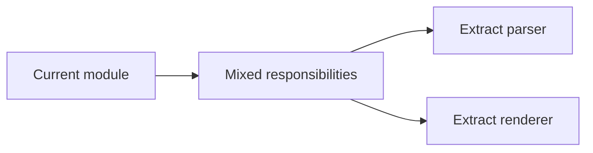

# refactor — Solution 模板

## Type-Specific Analysis 必填字段

1. **重构目标** — 当前结构问题是什么，重构后期望达到什么状态。
2. **影响范围** — 涉及的模块、文件、接口或配置。
3. **不变约束** — 对外行为、输入输出、配置语义必须保持不变的部分。
4. **重构策略** — 分步拆解，每步保持可验证。
5. **回归验证方式** — 现有测试是否覆盖，需要补充什么验证。
6. **风险点** — 可能破坏行为或隐藏耦合的位置。

## Visual Model

`refactor` 建议使用 Mermaid 图表达结构变化。

- 使用 `flowchart` 描述重构前后的模块关系。
- 如果涉及对象模型或类型关系，可用 `classDiagram`。
- 必须说明行为不变的边界；图只表达结构，不表达新增功能。

示例：

## Acceptance 写法

- 外部行为保持一致。
- 目标结构达成。
- 每个重构步骤可单独验证。
- 回归风险有验证方式。

## Confirmation Needed 建议

- 不变约束是否完整。
- 影响范围是否准确。
- 重构策略是否足够渐进。
- 回归验证方式是否可接受。

## solution-task 提示

- 每步重构前先确认当前验证为绿色。
- 如有测试缺口，先补验证再重构。
